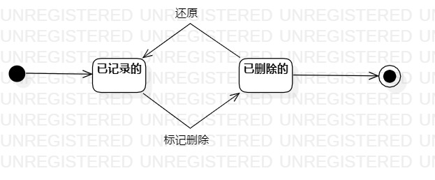

## 实验七：状态图

### 一、实验目标

1、掌握对象状态建模

### 二、实验内容

1、根据用例图、类图和时序图，找到重点对象

2、找到对象的存在状态

3、找到状态转换的条件

### 三、实验步骤

1、找到重点对象：消费情况

2、找到对象的存在状态

​      --已记录的

​      --标记删除的

3、找到状态转换条件

​      --还原

​      --标记删除

4、画状态图

### 四、实验结果

