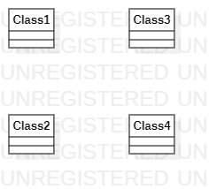
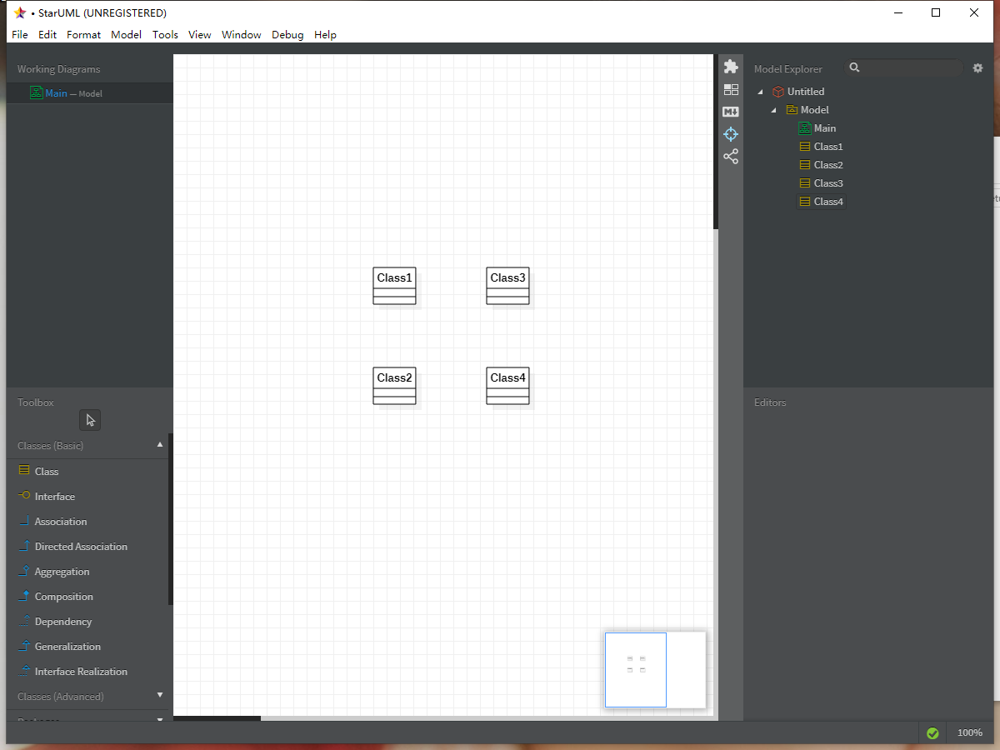

# 实验一

## 一、实验目标

1.熟悉GitHub实验过程

2.安装与使用StarUML

3.确定个人建模选题

## 二、实验内容

1.安装GitHub并练习使用Git Bash

2.安装StarUML并创建一个图

3.描述个人选题功能

## 三、实验步骤

1.在个人电脑中安装好Git工具和StarUML

2.在GitHub上从老师的项目上Fork到自己的账号下，打开Git Bash，将账号下的库clone到本地

3.clone成功后在本地库下的students文件夹下创建自己的学号文件夹

4.在自己的学号文件夹下创建Markdown实验报告并按实验要求编写

5.使用StarUML创建第一张UML图用jpg格式保存在自己的学号文件夹下

6.使用Git Bash将本地仓库修改的内容push到账号仓库

7.pull Request，请求合并到主仓库

8.在主场库的Issues下new issue自己的选题

## 四、实验结果

1.第一张UML图

2.StarUML工具截图

3.个人选题描述

- 题目：游玩通
- 介绍：可以让用户快速了解一个城市的著名旅游打卡地点以及花费的预估
- 功能：1、城市搜索：用户只需要输入查找的目的地，系统就会将目的地的著名景点的帖子列出，供用户查看；2、评论盖楼：在每个著名景点的帖子下，打卡过该地点的用户可以上传一些照片、消费情况和具体评价供给其他用户参考。

