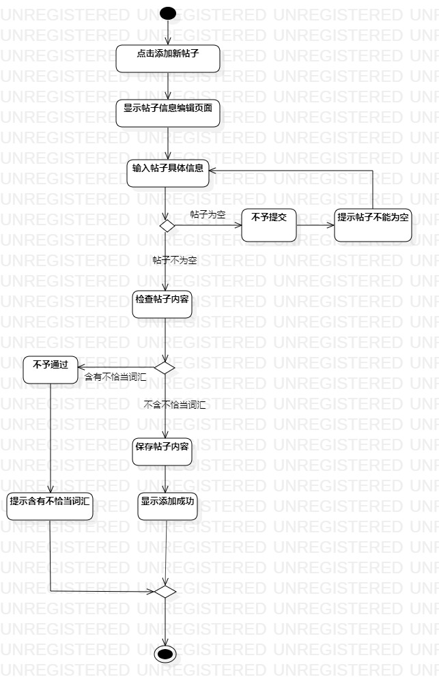
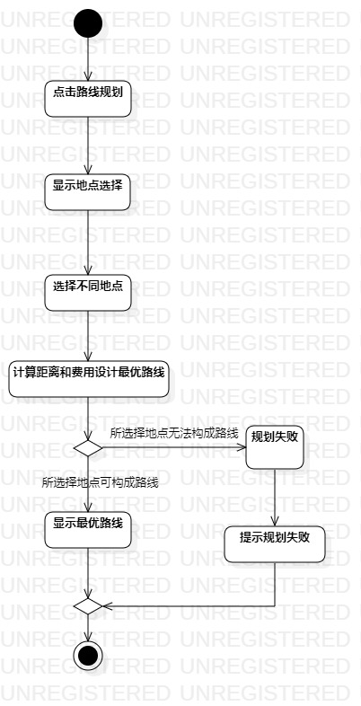

# 实验三：过程建模

## 一、实验目标

1、掌握使用StarUML做过程建模；

2、掌握活动图（Activity Diagram）的画法；

3、在Pull Request的首页显示活动图；

## 二、实验内容

1、画出添加帖子和路线规划的活动图；

2、提交实验报告（lab3.md）并将活动图显示在Pull Request首页；

## 三、实验步骤

1、绘画活动图

- 打开StarUML；
- 在Model下创建Activity Diagram：
  - 右键model--->Add Diagram--->Activity Diagram
- 添加帖子活动图
  - Initial
  - Action（点击添加新帖子）
  - Action（显示帖子信息编辑页面）
  - Action（输入帖子具体信息）
  - Action（检查帖子内容）
  - Action（提示帖子内容不能为空）
  - Action（提示含有不恰当词汇）
  - Action（保存帖子内容）
  - Action（显示添加成功）
  - Final
- 路线规划活动图
  - Initial
  - Action（驴友选择景点）
  - Action（点击路线规划）
  - Action（系统检查景点路线）
  - Action（计算距离和费用）
  - Action（提示规划失败）
  - Action（显示最优路线）
  - Final

2、提交请求时在Pull Request首页显示活动图

## 四、实验结果

图1：添加帖子活动图

图2：路线规划活动图