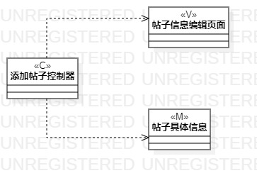
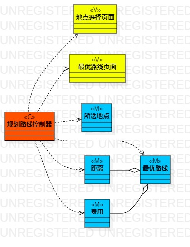

# 实验四、五：类建模

## 一、实验目标

1、修改实验三实验二错误内容

2、掌握类建模概念

3、学习理解类的五种关系（弱~强）

4、学习MVC

5、学会类图（ Class Diagram ）的绘制

## 二、实验内容

1、修改实验二和实验三实验报告

2、修改过程建模的两张UML图

3、基于MVC设计类和类之间的关系

4、绘制出类图（Class Diagram）

## 三、实验步骤

1、修改实验二的用例规约，删除掉用例规约中不是操作的步骤

2、修改“添加帖子”和“路线规划”的活动图

- 删除一个选择节点，因为该节点前面的操作不是多种结果的操作
- 删除掉不是操作的步骤

3、修改实验三实验报告内容

4、通过用例规约设计出类（基于MVC）

- 根据“添加帖子”用例设计类
  - 添加帖子控制器（C）
  - 帖子信息编辑页面（V）
  - 帖子具体信息（M）
- 根据“规划路线”用例设计类
  - 规划路线控制器（C）
  - 景点选择页面（V）
  - 最优路线页面（V）
  - 景点（M）
  - 最优路线（M）

5、绘制类图（Class Diagram）

- 打开StarUML
- 在Model下创建Class Diagram：
  - 右键model-->Add Diagram-->Class Diagram
- 画“添加帖子”用例的类图
  - 画出类
    - 添加帖子控制器（C）
    - 帖子页面（V）
    - 帖子（M）
  - 画出类之间的关系
    - Dependency（添加帖子控制器---->帖子页面）
    - Dependency（添加帖子控制器---->帖子）
- 画出“规划路线”用例的类图
  - 画出类
    - 规划路线控制器（C）
    - 景点选择页面（V）
    - 最优路线页面（V）
    - 最优路线（M）
    - 景点（M）
  - 画出类之间的关系
    - Dependency（规划路线控制器---->景点选择页面）
    - Dependency（规划路线控制器---->最优路线页面）
    - Dependency（规划路线控制器---->景点）
    - Dependency（规划路线控制器---->最优路线）

## 四、实验结果

图1：添加帖子类图

图2：路线规划类图

