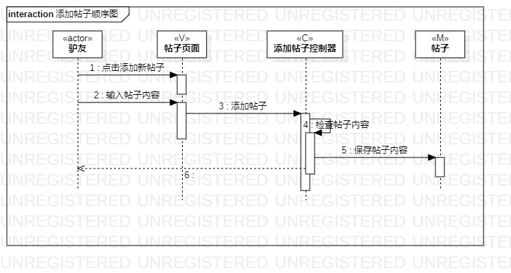
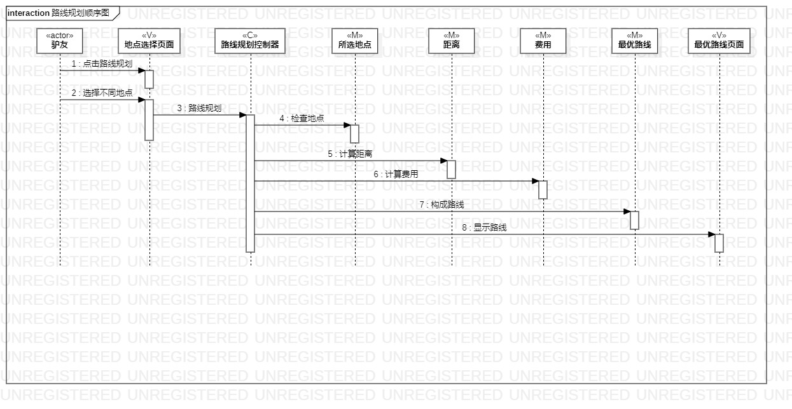

# 实验六：交互建模

## 一、实验目标

1、理解系统交互；

2、掌握UML顺序图画法；

3、掌握对象交互的定义与建模方法；

## 二、实验内容

1、根据用例模型和类模型，确定功能所涉及的系统对象；

2、在顺序图上画出参与者（对象）；

3、在顺序图上画出消息（交互）；

## 三、实验步骤

1、根据用例规约抽象出对象

- 根据“添加帖子”用例
  - 驴友（actor）
  - 帖子页面（V）
  - 添加帖子控制器（C）
  - 帖子（M）
- 根据“路线规划”用例
  - 驴友（actor）
  - 景点选择页面（V）
  - 路线规划控制器（C）
  - 景点（M）
  - 最优路线（M）
  - 最优路线页面（V）

2、画出时间线

- 添加帖子
  - 点击添加帖子（驴友---->帖子页面）
  - 输入帖子内容（驴友---->帖子页面）
  - 添加帖子（帖子页面---->添加帖子控制器）
  - 检查帖子内容（添加帖子控制器---->添加帖子控制器）
  - 保存帖子内容（添加帖子控制器---->帖子）
- 路线规划
  - 选择景点（驴友---->景点选择页面）
  - 点击路线规划（驴友---->景点选择页面）
  - 路线规划（景点选择页面---->路线规划控制器）
  - 检查景点（路线规划控制器---->景点）
  - 计算距离和费用（路线规划控制器---->最优路线）
  - 显示最优路线（路线规划控制器---->最优路线页面）

## 四、实验结果

图1：添加帖子顺序图

图2：路线规划顺序图