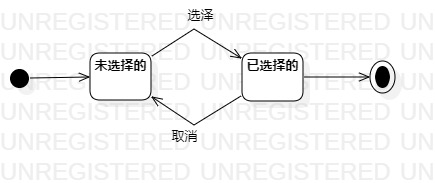

# 实验七：状态建模

## 一、实验目标

1、掌握对象状态建模（状态图）

## 二、实验内容

1、选择一个系统对象画出状态图

## 三、实验步骤

1、选择系统的关键对象：景点

2、设计景点的关键状态为：未选择的和已选择的

3、在StarUML中创建Statechart Diagram

4、画出景点的两种状态

5、状态的转变分别为选择和取消

## 四、实验结果

图1：景点的状态图