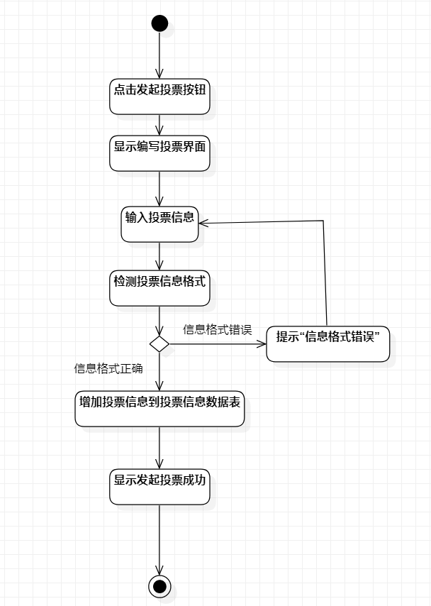
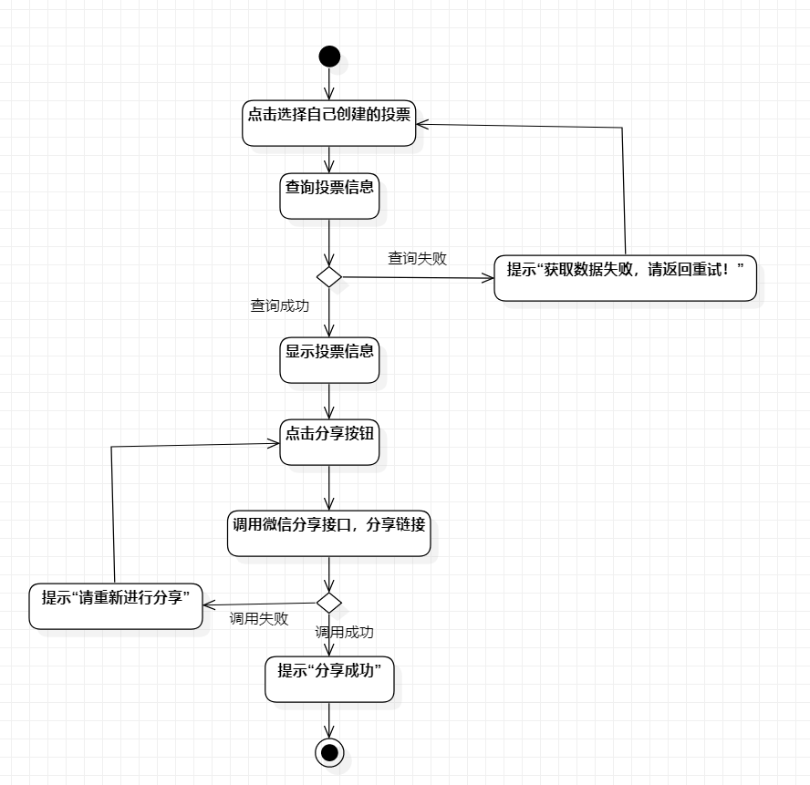

# 实验三：过程建模

## 一、实验目标

1、掌握过程建模方法

2、掌握活动图的画法（Activity Diagram）

## 二、实验内容

1、掌握过程建模的方法

2、运用StarUML绘制实验二用例规约的活动图

## 三、实验步骤

1.使用StarUML新建Activity Diagram

2.打开实验二用例规约，参照并绘制活动图，同时按需求更改用例规约

3.了解“Initial”、“Final”、“Action”等符号的含义，绘制活动图

## 四、实验结果

### 活动图如下：

图1：发起投票活动图

图2：参与投票活动图

