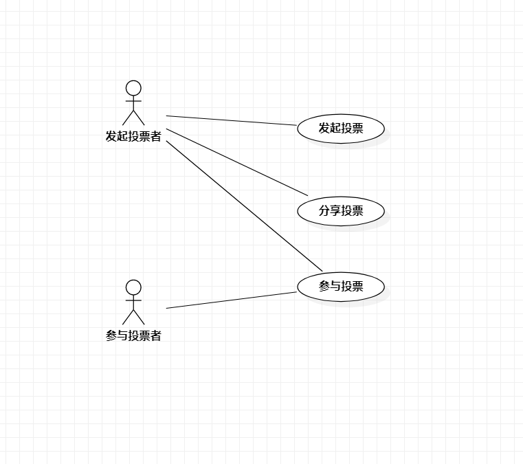

# 实验二

## 一. 实验目标
1. 学习用例建模
2. 绘制用例建模图

## 二. 实验内容
1. 确定系统的主题和功能点  
2. 在StarUML中画建模用例图

## 三. 实验步骤
1. 确定选题  
   投票小程序  
2. 确定选题的用户分类和功能   
   用户：发起投票者、参与投票者  
   功能：发起投票、分享投票、参与投票  
3. 使用StarUML画建模用例图

## 四.实验结果

图1：投票小程序用例图
# 用例规约的编写

## 表1：发起投票用例规约  

用例编号  | UC01 | 备注  
-|:-|-  
用例名称  | 发起投票  |   
前置条件  |      |    
后置条件  |      |   
基本流程  | 1. 发起投票者编写投票信息  | 
~| 2. 点击发起投票按钮  |   
~| 3. 系统检查投票信息格式正确   |   
~| 4. 系统增加投票信息到投票信息数据表  |   
~| 5. 系统显示发起投票成功 |  
扩展流程  | 3.1 系统检查投票信息格式错误，提示“信息格式错误” | 
~| 4.1 系统增加投票信息到投票信息数据表失败，提示“发起投票失败，请重新发起投票” |   

## 表2：参与投票用例规约  

用例编号  | UC02 | 备注  
-|:-|-  
用例名称  | 参与投票  |   
前置条件  | 投票者拥有投票链接     |   
后置条件  |      |   
基本流程  | 1. 投票者点击投票链接  |    
~| 2. 系统查询投票信息，显示投票信息  |   
~| 3. 投票者点击投票按钮进行投票  |   
~| 4. 系统更新投票信息，显示更新后的投票信息  |     
扩展流程  | 2.1 系统查询不到投票信息，提示“获取数据失败，请返回重试！”  |    
~| 4.1 系统更新投票信息失败，提示“投票失败，请重新进行投票”   |  
