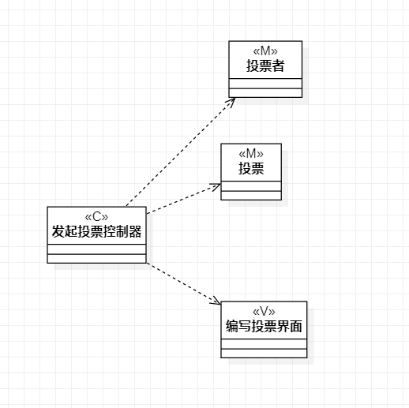
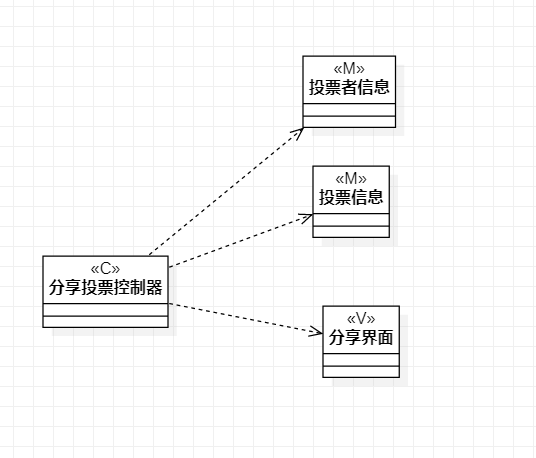

# 实验四、五：类建模与高级类建模

## 一、实验目标

1. 掌握类建模方法；

2. 了解MVC设计模式；

3. 掌握类的五种关系；

4. 掌握类图的画法。

## 二、实验内容

1. 使用MVC模式设计类；

2. 根据类的关系；

3. 画出类图。

## 三、实验步骤

1. 根据用例规约寻找类：

2. 根据用例，设计类：

3. 根据MVC模式创建类及类之间的依赖关系和包含关系

4. 完成类图的设计、编写实验报告并提交。

## 四、实验结果

图1：发起投票类图

图2：参与投票类图

