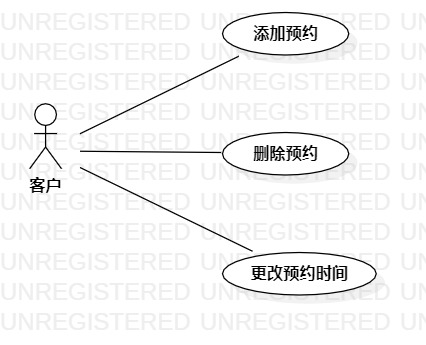

# 实验二：用例建模

## 一、实验目标

1.学会使用Markown编写实验报告

2.掌握用例建模

## 二、实验内容

1.将个人选题提交到Issue

2.用Markdown编写实验报告

3.用StarlUml完成用例建模

## 三、实验步骤

1.提交个人选题：餐厅预订系统

2.确定参与者:

  - 客户
  
3.确定实例:

  - 添加预约
  - 删除预约
  - 更改预约时间

4.完成用例图

5.编写用例规范

## 四、实验结果

  
图1:餐厅预订系统用例图

## 表1：餐厅预约用例规约  

用例编号  | UC01 | 备注  
-|:-|-  
用例名称  | 添加预约  |   
前置条件  |      | *可选*   
后置条件  | 选择预约时间    | *可选*   
基本流程  | 1. 客户点击预约按钮;  |*用例执行成功的步骤*    
~| 2. 系统显示时间选择页面;  |   
~| 3. 客户选择预约时间并确认预约;   |   
~| 4. 系统进行预约;   |   
~| 5. 系统提示预约完成。  |  
扩展流程  | 4.1 系统检查发现该时间段已被预约   |*用例执行失败*    

用例编号  | UC02 | 备注  
-|:-|-  
用例名称  | 删除预约  |   
前置条件  | 预约成功     | *可选*   
后置条件  |      | *可选*   
基本流程  | 1. 客户点击预约管理按钮;  |*用例执行成功的步骤*    
~| 2. 系统显示客户预约管理界面;  |   
~| 3. 客户选择预约时间并确认删除;   |   
~| 4. 系统进行预约删除;   |   
~| 5. 系统提示预约删除完成。  |  
扩展流程  |    |*用例执行失败*    

用例编号  | UC02 | 备注  
-|:-|-  
用例名称  | 更改预约时间  |   
前置条件  | 预约成功     | *可选*   
后置条件  |      | *可选*   
基本流程  | 1. 客户点击预约管理按钮;  |*用例执行成功的步骤*    
~| 2. 系统显示客户预约管理界面;  |   
~| 3. 客户选择预约时间并确认更改;   |   
~| 4. 系统进行预约时间更改;   |   
~| 5. 系统提示预约时间更改完成。  |  
扩展流程  |    |*用例执行失败*    
