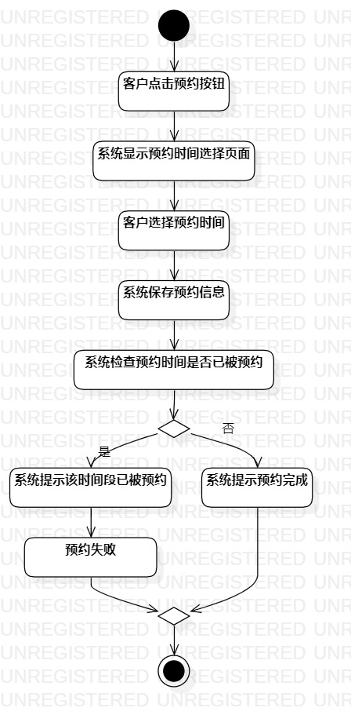
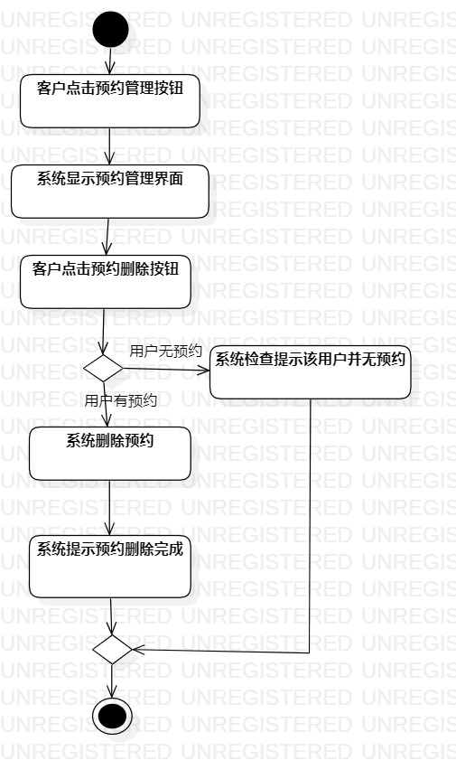
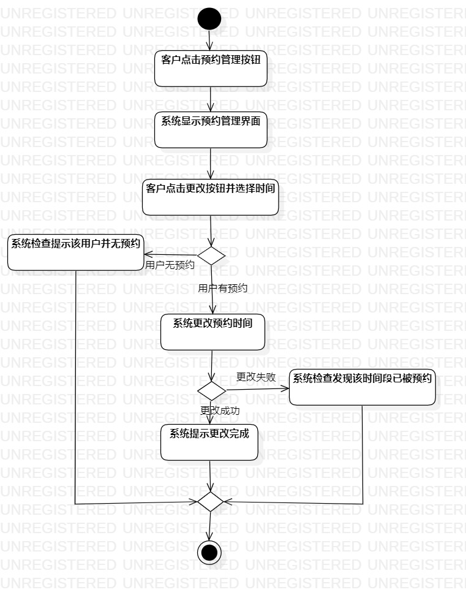

# 实验三：过程建模

## 1. 实验目标

- 掌握过程建模方法
- 掌握活动图的画法

## 2. 实验内容

- 利用StarUML画出活动图
- 熟悉活动图符号的用法和意义
- 编写实验报告

## 3. 实验步骤

1.观看教学视频进行学习

2.查看用例规范并检查是否需要更改语义

3.根据添加预约用例规约画出用例的活动图

4.根据更改预约用例规约画出用例的活动图

5.根据删除预约用例规约画出用例的活动图

6. 编写实验报告

## 4. 实验结果

图1：添加预约活动图

图1：删除预约活动图

图1：更新预约活动图
