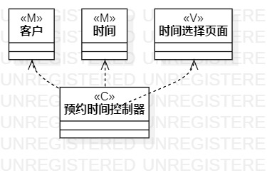
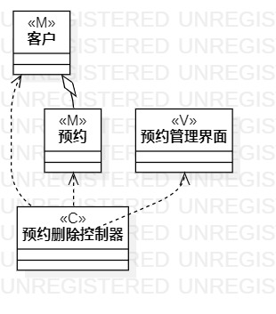

# 实验四、五：类建模

## 1. 实验目标

- 掌握类建模方法
- 设计类的关系
- 画出类图
- 理解类的五种关系
- 掌握类之间的关系画法

## 2. 实验内容

- 基于MVC模式设计类
- 设计类的关系
- 画出类图

## 3. 实验步骤

1.观看教学视频进行学习

2.根据添加预约用例规约画出用例的类图

3.根据更改预约用例规约画出用例的类图

4.根据删除预约用例规约画出用例的类图

5. 编写实验报告

## 4. 实验结果

图1：添加预约类图

图1：删除预约类图

图1：更新预约类图
