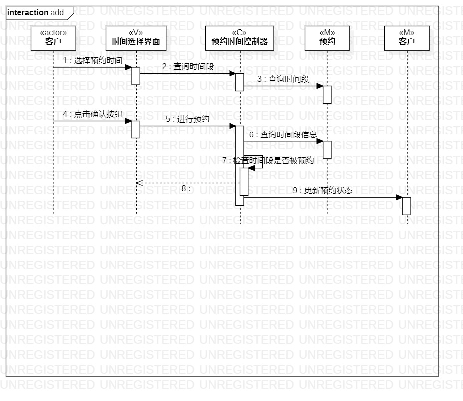
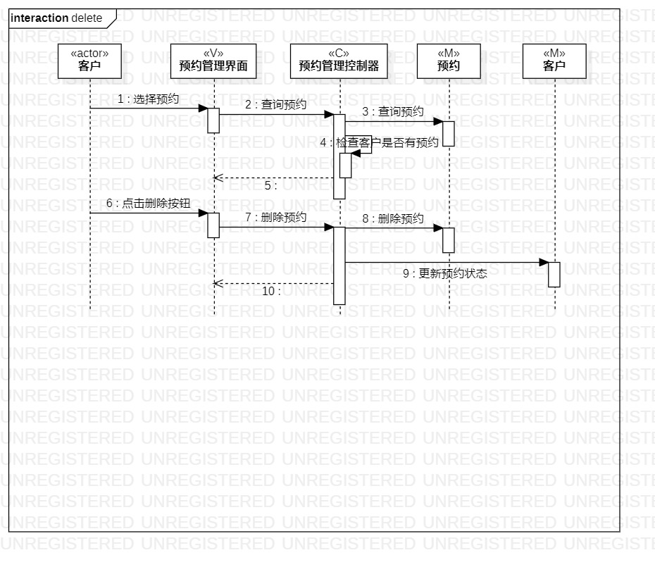
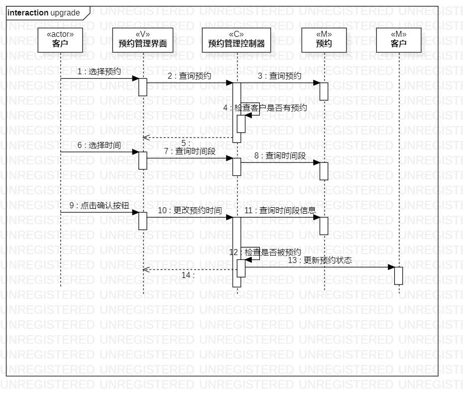

# 实验六：交互建模

## 1. 实验目标

- 理解系统交互；
- 掌握UML顺序图的画法；
- 掌握对象交互的定义与建模方法。

## 2. 实验内容

- 根据用例模型和类模型，确定功能所涉及的系统对象；
- 在顺序图上画出参与者（对象）；
- 在顺序图上画出消息（交互）。

## 3. 实验步骤

1.观看教学视频进行学习

2.查看之前的实验是否需要修改

3.画出添加预约顺序图

4.画出删除预约顺序图

5.画出更改预约顺序图

6. 编写实验报告

## 4. 实验结果

图1：添加预约顺序图

图1：删除预约顺序图

图1：更改预约顺序图
