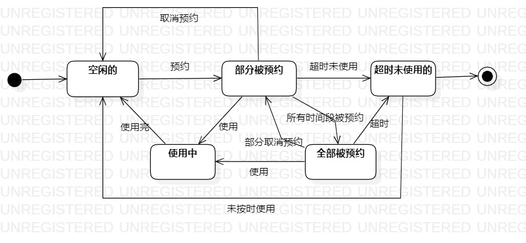

# 实验七：状态建模

## 1. 实验目标

- 掌握对象状态建模（状态图，Statechart）。

## 2. 实验内容

- 根据前面所有的实验确定状态图对象；
- 确定这个对象的所有状态；
- 画出状态之间的转变条件。

## 3. 实验步骤

1.观看教学视频进行学习；

2.从本系统（餐厅预约系统）中找出一个关键对象，即包间；

3.设计包间的关键状态：

- 空闲
- 被预约
- 使用中
- 超时未赴约

4.用StarUML画出该对象的状态图（StatechartDiagram）

5.编写实验报告

## 4. 实验结果

图1：预约状态图

