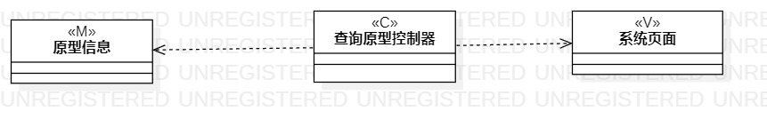

#  实验1
## 1. 实验目标
  - 获取并了解建模工具StarUML
  - 确人个人选题
## 2. 实验内容
  - 下载并安装建模工具 StarUML
  - 画出第一个建模图
  - 确定个人建模选题，将选题填写在 Issues 中：
## 3. 实验步骤
1. 下载StarUML并安装
2. 工具安装之后，创建第一个建模图并截图，保存在实验报告中
3. 依据实验要求，思考并确定个人选题
4. 将个人选题及描述写在实验报告中
5. 提交实验报告
## 4. 实验结果

