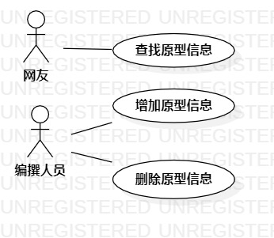

# 实验目标
- 画出用例图。
- 编写用例规约。
# 实验内容
## 1.确认选题为角色原型信息系统
## 2.根据选题绘制用例图
- 确定人员
- 确定用例
- 建立人员和用例的连接
## 3. 编写用例规约
# 实验结果

   
 图1 角色原型标题系统用例图
 
 ## 表1：查找原型标题用例规约  

用例编号  | C1 | 备注  
-|:-|-  
用例名称  | 查找原型标题  |   
前置条件  | 网友进入系统网页    |  
后置条件  |  |   
基本流程  | 1.网友点击搜索框  |*用例执行成功的步骤*  
~| 2.网友输入搜索内容并点击搜索按钮  |
~| 3.系统查找原型标题  |
~| 4.系统找到相符标题，返回原型信息标题列表   |   
扩展流程  | 4.1 系统未找到相符标题，提示“无结果” | 

## 表2：增加原型描述用例规约  

用例编号  | C2 | 备注  
-|:-|-  
用例名称  | 增加原型描述  |   
前置条件  | 编撰人员登陆账号    |    
后置条件  |      |  
基本流程  | 1. 编撰人员点击增加按钮  |  *用例执行成功的步骤*  
~| 2. 系统跳转到原型文本编写页面  |  
~| 3. 编撰人员编写并提交角色原型描述  |   
~| 4. 系统检测无重名标题，保存角色原型描述  | 
扩展流程  | 4.1 系统检测有重名标题，提示“重名标题” | *用例执行失败的步骤*  

## 表3：删除原型描述用例规约

用例编号  | C3 | 备注  
-|:-|-  
用例名称  | 删除原型描述  |   
前置条件  | 编撰人员登陆账号    | 
后置条件  |      |   
基本流程  | 1. 编撰人员点击删除按钮  |  *用例执行成功的步骤*  
~| 2. 系统检测操作人员权限 |
~| 3. 系统确认操作人为编撰人员，系统删除角色原型描述  |   
扩展流程  | 3.1 操作人为非编撰人员，系统提示“无删除权限” |  *用例执行失败的步骤*  

