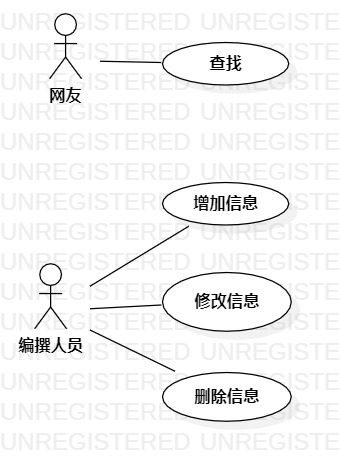

# 实验目标
- 细化功能需求。
- 画出用例图。
- 编写用例规约。
# 实验内容
## 1.确认选题为角色原型信息系统
## 2.根据选题绘制用例图
- 确定人员
- 确定用例
- 建立人员和用例的连接
## 3. 编写用例规约
# 实验结果

   
 图1 角色原型信息系统用例图
 
 ## 表1：查找用例规约  

用例编号  | C1 | 备注  
-|:-|-  
用例名称  | 查找  |   
前置条件  | 网友进入网页    |  
后置条件  |  |   
基本流程  | 1. 网友点击搜索框  |*用例执行成功的步骤*    
~| 2. 网友输入查询内容  |   
~| 3. 网友确认搜索  |   
~| 4. 系统返回符合搜索内容的相关角色原型信息的内容  |    

## 表2：增加信息用例规约  

用例编号  | C2 | 备注  
-|:-|-  
用例名称  | 增加信息  |   
前置条件  | 编撰人员进入编撰界面    |    
后置条件  |      |  
基本流程  | 1. 编撰人员点击增加按钮；  |*用例执行成功的步骤*     
~| 2. 编撰人员编写角色原型信息的内容  |   
~| 3. 编撰人员提交角色原型信息的内容  | 
扩展流程  | 2.1 系统检测已有同一角色原型的内容，拒绝增加该角色原型信息 | 
~| 2.2 系统跳转编撰界面  | 

## 表3：修改信息用例规约   

用例编号  | C3 | 备注  
-|:-|-  
用例名称  | 修改信息  |   
前置条件  | 编撰人员进入编撰界面    |   
后置条件  |      |  
基本流程  | 1. 编撰人员点击修改按钮  |*用例执行成功的步骤*     
~| 2. 编撰人员修改角色原型信息的内容  |   
~| 3. 编撰人员提交角色原型信息的内容的修改  |  

## 表4：删除信息用例规约

用例编号  | C4 | 备注  
-|:-|-  
用例名称  | 删除信息  |   
前置条件  | 编撰人员进入编撰界面    | 
后置条件  |      |   
基本流程  | 1. 编撰人员点击点击删除按钮  |*用例执行成功的步骤*     
~| 2. 系统删除对应角色原型信息  |   

