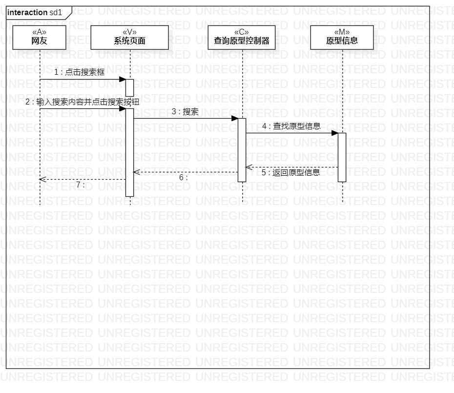
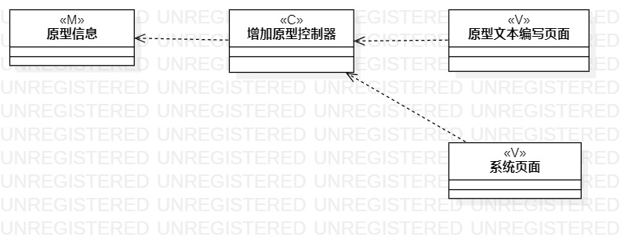
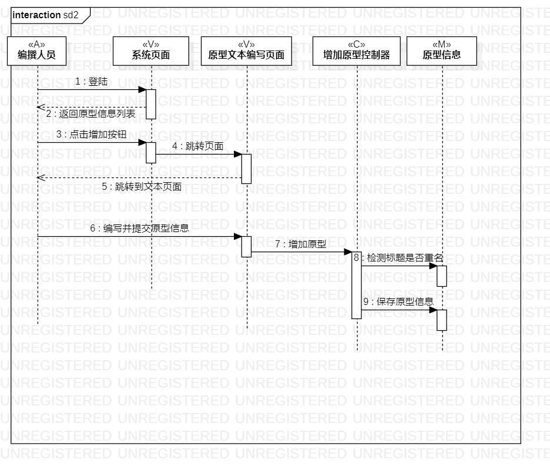
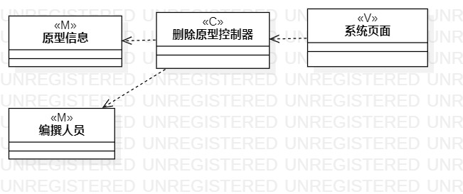
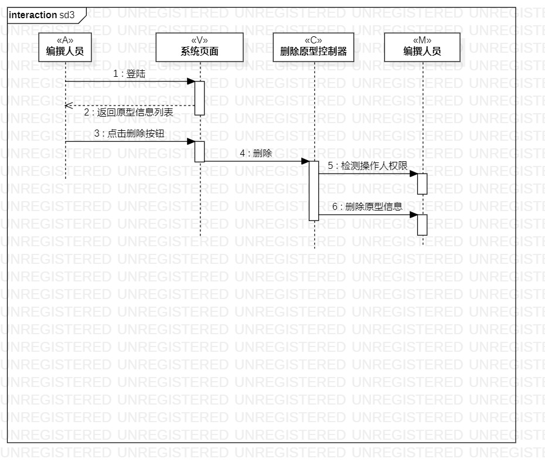

# 实验目标
1. 理解系统交互；
2. 掌握UML顺序图的画法；
3. 掌握对象交互的定义与建模方法。
# 实验内容
- 根据自己的活动图和类图，确定对象
- 根据自己的活动图和类图，确定对象的交互关系
- 画出顺序图
# 实验步骤
1. 观看老师的视频并学习
2. 针对自己的系统，对象与交互
4. 画出第一版顺序图
3. 观看教师的“问题答疑”视频，找出自己的图的问题
4. 修改与检查顺序图，确保顺序图与活动图、类图一致
5. 撰写实验报告

# 实验结果图
  
  
  
## 查询原型顺序图
  
  
  
## 增加原型顺序图
  
  
  
## 删除原型顺序图
