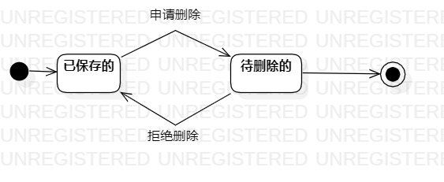

# 实验目标
 - 掌握对象状态建模
 - 理解系统自身对象的状态
# 实验内容
1. 观看教学视频
2. 参考教学，根据自己系统的对象进行状态建模
3. 观看相关问题解答视频，修改自己的状态图的错误
4. 依据状态图发现的问题，修改前面实验的图
5. 完成实验报告
# 实验步骤
1. 找出系统中的对象及其状态
2. 在STARUML中画出基础的状态图
3. 找出细节错误，修改状态图
4. 修改其他的图
5. 对比状态图与其他图，确保协调一致
# 实验结果

