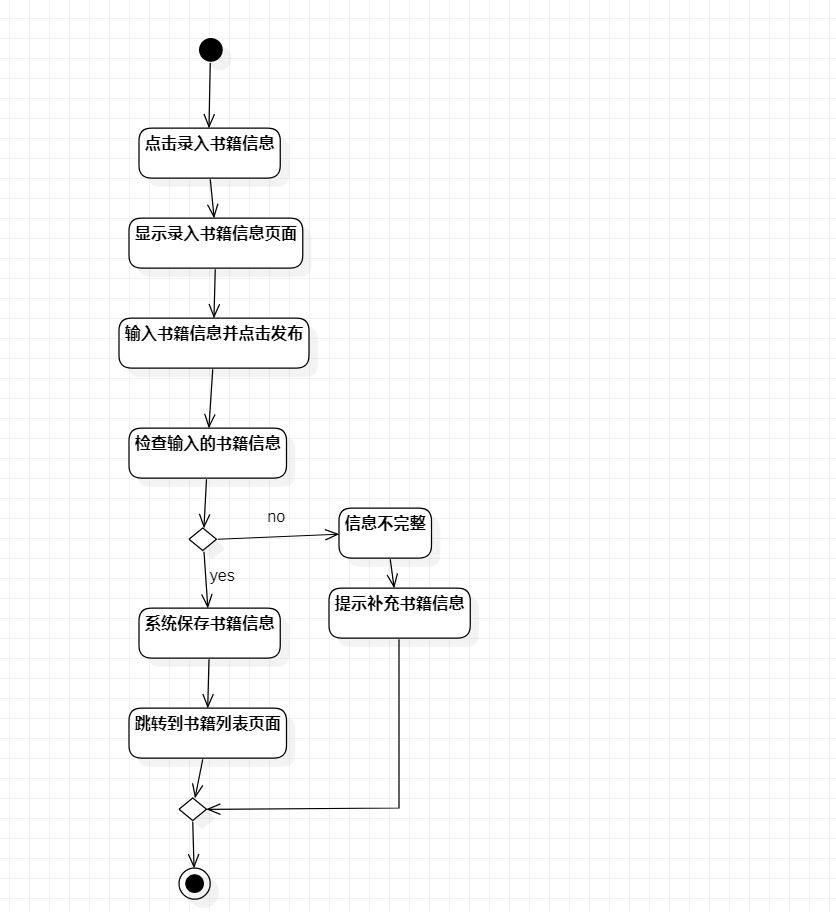
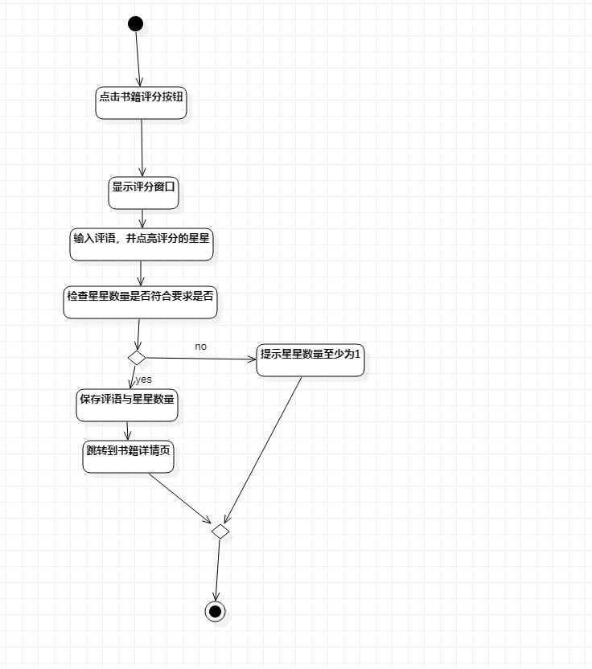

# 实验三：过程建模

## 1. 实验内容

- 掌握过程建模方法
- 掌握活动图的画法

## 2. 实验要求

- 利用StarUML画出活动图
- 熟悉活动图符号的用法和意义
- 编写实验报告

## 3. 实验步骤

- 观看教学视频学习StarUML

- 打开自己实验二的实验报告查看用例规约

- 根据管理员录入书籍信息用例规约画出用例的活动图

- 根据用户对书籍评分用例规约画出用例的活动图

- 编写实验报告

  

## 4. 实验结果

- 

  图1：管理员录入书籍信息的活动图

- 

  图2：用户对书籍评分的活动图
