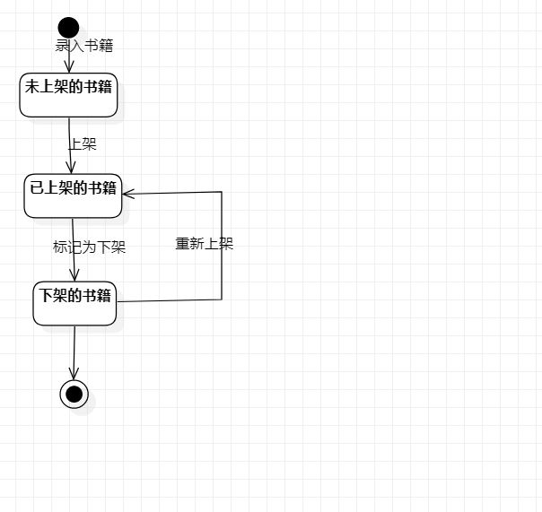

# 实验7：状态建模

## 一、实验目标

1. 掌握对象状态建模（状态图，Statechart）   

## 二、实验内容

1. 根据教学视频思考状态图  
2. 画出状态图  
3. 编写实验报告文档  

### 三、实验步骤

1. 根据用例图、活动图、类图、顺序图找出关键对象：书籍
2. 找出状态：未上架的、已上架的，已下架的画出状态图  
3. 编写实验报告文档

## 四、实验结果

图1.书籍的状态图  