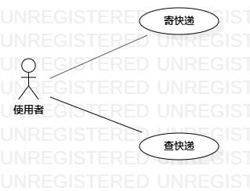

#  实验二： 用例建模

## 一、实验目标

1.完善选题

2.使用StarUML完成用例建模

3.使用Markdown编写文档

##  二、实验内容

1.根据选题创建用例图

2.编写Markdown实验报告文档

3.编写用例规约

## 三、实验步骤

1.确定用户（Actor）:

  -程序使用者

2.确定用例（UserCase）:

  -寄快递

  -查快递

3.建立之间的联系（Association)

4.编写用例规约

##  四、实验结果

图1：快递帮小程序的用例图

##  表1： 寄快递用例规约

| 用例编号 | UC01                                              | 备注                 |
| -------- | :------------------------------------------------ | -------------------- |
| 用例名称 | 寄快递                                            |                      |
| 前置条件 | 使用者登录进入快递帮小程序                        | *可选*               |
| 后置条件 | 使用者进入小程序首页                              | *可选*               |
| 基本流程 | 1.使用者点击寄快递按钮；                          | *用例执行成功的步骤* |
| ~        | 2.系统显示寄件信息录入页面；                      |                      |
| ~        | 3.使用者输入寄件信息，点击提交按钮；              |                      |
| ~        | 4.系统检查输入信息格式无误，保存寄件信息；        |                      |
| ~        | 5.系统显示提交成功页面。                          |                      |
| 扩展流程 | 4.1系统检查输入信息格式有误，提示使用者重新输入。 | *用例执行失败*       |

## 表2：查快递用例规约

| 用例编号 | UC02                                               | 备注                 |
| -------- | :------------------------------------------------- | -------------------- |
| 用例名称 | 查快递                                             |                      |
| 前置条件 | 使用者进入小程序首页                               | *可选*               |
| 后置条件 |                                                    | *可选*               |
| 基本流程 | 1.使用者点击查快递按钮；                           | *用例执行成功的步骤* |
| ~        | 2.系统显示快递单号录入页面；                       |                      |
| ~        | 3.使用者输入快递单号，点击查询按钮；               |                      |
| ~        | 4.系统检查快递单号不为空，查询快递物流信息；       |                      |
| ~        | 5.系统显示快递物流信息。                           |                      |
| 扩展流程 | 4.1.系统检查快递单号为空，显示“快递单号不能为空”。 | *用例执行失败*       |

