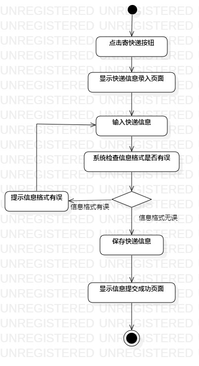
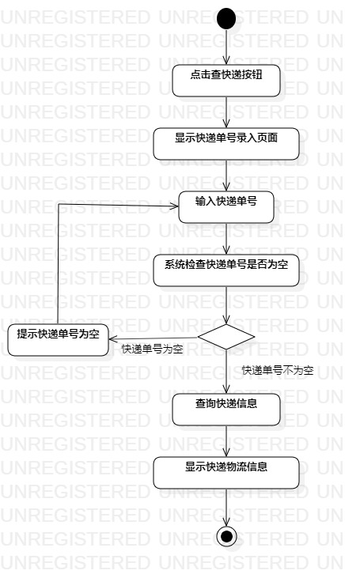

# 实验三：过程建模

## 一、实验目标

1.掌握过程建模方法；

2.掌握活动图(Activity Diagram)的画法。

## 二、实验内容

1.根据用例规约画出活动图；

2.编写实验报告。

##  三、实验步骤

1.添加开始结点和结束结点；

2.根据用例规约添加活动(Action)；

3.添加决策分支(Decision)；

4.使用Control flow连接各个部分；

5.另一个活动图重复以上步骤。

## 四、实验结果

图1：寄快递活动图

图2：查快递活动图

