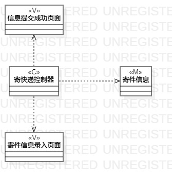
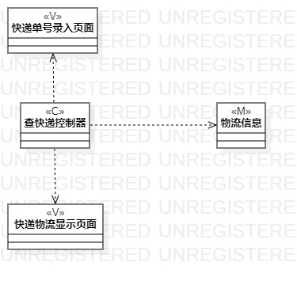

# 实验四、五：类建模

## 一、实验目标

1.掌握类的概念和构成；

2.掌握类建模方法；

3.了解MVC或其它设计模式；

4.掌握类图的画法。

## 二、实验内容

1.根据用例规约画出相关类图；

2.编写实验报告。

## 三、实验步骤

1.根据用例规约画出必要的类；

2.根据MVC设计模式确定类的关系；

3.连接各个类。

## 四、实验结果

图1：寄快递的类图

图2：查快递的类图

