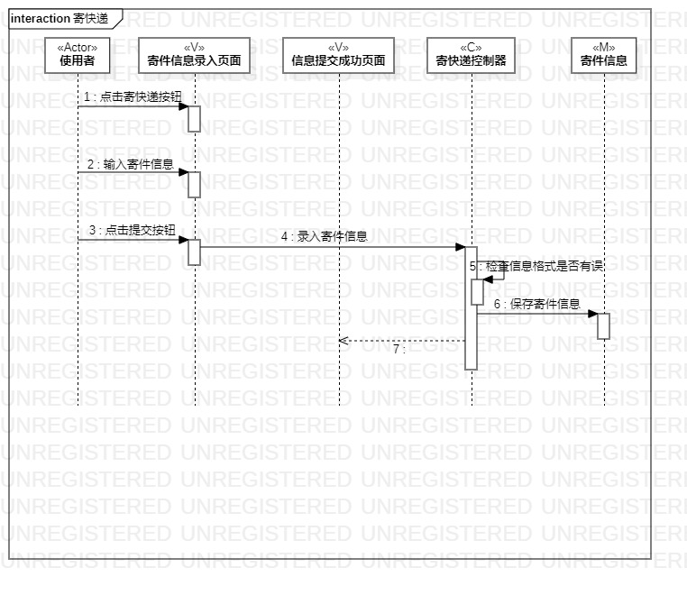
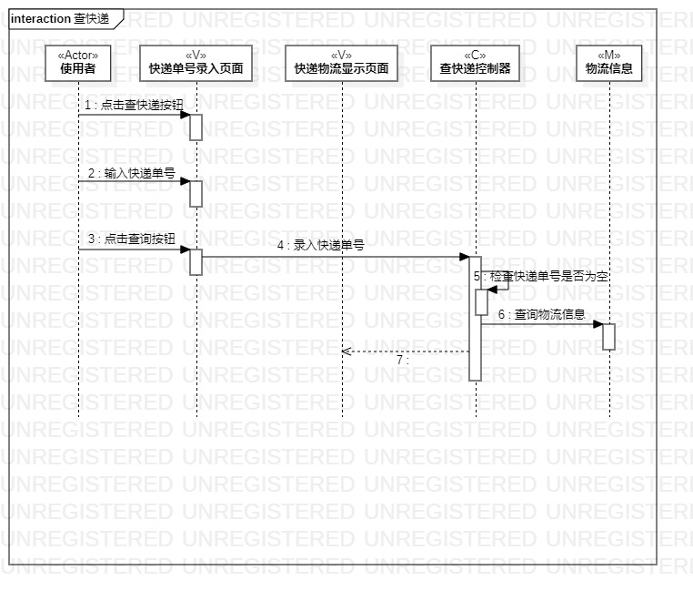

# 实验六：交互建模

## 一、实验目标

1.理解系统交互；

2.掌握UML顺序图的画法；

3.掌握对象交互的定义与建模方法。

## 二、实验内容

1.根据用例模型和类模型确定对象；

2.在顺序图上画出参与者；

3.根据活动中的操作步骤画出顺序图上的消息。

## 三、实验步骤

1.使用StarUml创建顺序图；

2.根据用例图和类图画出参与者；

3.根据活动图的操作步骤绘制参与者之间的消息。

## 四、实验结果

图1：寄快递顺序图

图2：查快递顺序图

