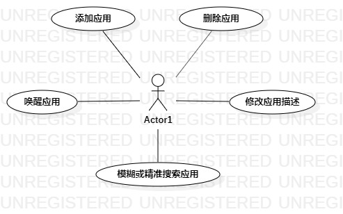

# 实验二：用例建模  

## 一、 实验目标  

1. 使用Markdown编写报告
2. 细化选题
3. 学习使用StarUML用例建模

## 二、 实验内容  

1. 创建用例图
2. 编写实验报告文档
3. 编写用例规约

## 三、 实验步骤  

1. 选题为win os应用管理系统 
2. 根据issues在StarUML上创建用例图（UseCase2233）
3. 确定参与者（Actor）:  
      - 计算机管理员   
4. 确定用例（UserCase）:   
      - 添加应用
      - 删除应用
      - 唤醒应用
      - 修改应用描述
      - 模糊或者精准搜索应用
5. 建立Actor和UserCase之间的联系
6. 绘画用例图（Lab2_UseCaseDiagram）
7. 编写用例规约

## 四、 实验结果  

1. 画图  
  
图1:win os应用管理系统的用例图

## 表1：录入应用用例规约  

用例编号  | UC01 | 备注  
-|:-|-  
用例名称  | 添加应用  |   
前置条件  | 计算机管理员进入系统应用列表    | *可选*   
后置条件  |      | *可选*   
基本流程  | 1. 计算机管理员点击添加应用；  |*用例执行成功的步骤*    
~| 2. 系统跳转至添加界面；  |   
~| 3. 计算机管理员录入应用名称，应用描述，应用唤醒指令；  |   
~| 4. 系统查询应用信息，检查未存在相同应用，保存应用信息；  |   
~| 5. 系统显示应用列表。  |  
扩展流程  | 4.1 系统检查发现应用已经存在，提示系统管理员“该应用已经存在”。 |*用例执行失败*    
~| 4.2 系统跳转至应用列表。  |  
