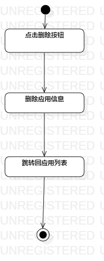
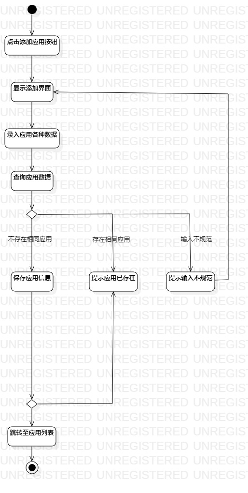
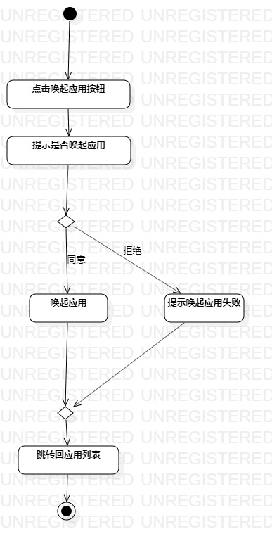

# 实验三：过程建模  

## 一、 实验目标  

1. 掌握过程建模方法；
2. 掌握活动图的画法。

## 二、 实验内容  

1. 绘制活动图
2. 修改用例规约
3. 编写实验报告

## 三、 实验步骤  

1. 按照用例规约绘制活动图
2. 根据绘制活动图同步修改用例规约
3. 修改活动图
4. 编写实验报告

## 四、 实验结果  
删除应用  
  
添加应用  
  
唤起应用  
  
