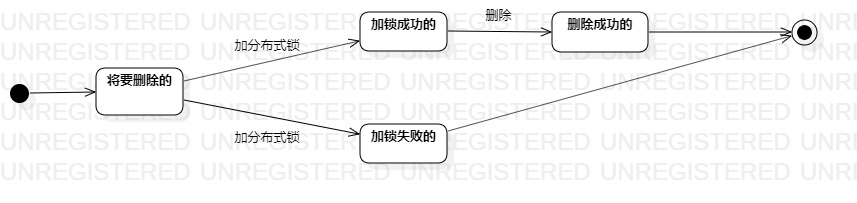

# 实验七：状态建模

## 一、实验目标

1. 掌握对象状态建模。

## 二、实验内容

1. 理解对象的概念；
2. 理解状态的概念；
3. 学习状态图的画法。

## 三、实验步骤

1. 找出关键对象：应用

2. 设计该对象的关键状态：
   - 将要删除的
   - 加锁成功的
   - 加锁失败的
   - 删除成功的
3. 描述状态间的转变条件

## 四、实验结果

应用状态图：

应用删除时需要加锁防止重复删除，只有加锁成功的才能获取到线程进行删除操作，删除时会反馈一个删除状态表明成功失败

  