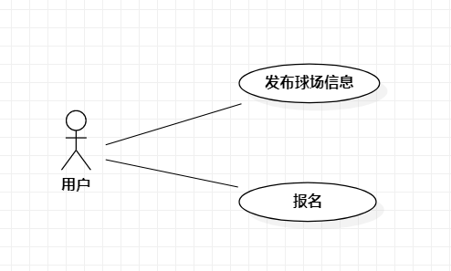

## 实验二：用例建模

## 1、实验目标
- 学会使用Markdown编写报告
- 学会使用StarUML绘制用例图
- 学会编写用例规约

## 2、实验内容
- 细化功能需求
- 画出用例图
- 编写用例规约

## 3、实验步骤
- 确定选题: 约球吧平台
- 确定用例
  - 发布招募帖
  - 报名
- 确定参与者：篮球爱好者
- 绘画用例图
- 编写用例规约

## 4、实验结果

图1.约球吧平台的用例图

## 表1：发布招募帖用例规约 

用例编号  | UC01 | 备注  
-|:-|-  
用例名称  | 发布招募帖  |   
前置条件  |篮球爱好者通过身份认证|    
后置条件  |  |   
基本流程  | 1. 篮球爱好者点击发布按钮；  | 用例执行成功的步骤
~| 2. 系统显示招募帖发布页面；  |   
~| 3. 篮球爱好者输入球场位置、已有人数，点击添加按钮；  | 
~| 4. 系统检查该位置存在球场，保存球场信息，保存并发布招募帖； |  
~| 5. 系统提示“发布成功”； |       
扩展流程  | 4.1 系统检查该位置不存在球场，提示“该位置没有球场” | 用例执行失败 

## 表2：报名用例规约 

用例编号  | UC02 | 备注  
-|:-|-  
用例名称  | 报名  |   
前置条件  |篮球爱好者通过身份认证|    
后置条件  | |   
基本流程  | 1. 篮球爱好者点击报名按钮；  | 用例执行成功的步骤 
~| 2. 系统显示报名页面； |   
~| 3. 篮球爱好者点击“我要报名”按钮； | 
~| 4. 系统检查球场人数未达上限，修改球场人数，保存报名信息；  |  
~| 5. 系统提示“报名成功”；  | 
扩展流程  | 4.1 系统检查球场人数已达上限，系统提示“人数已达上限” | 用例执行失败 

 