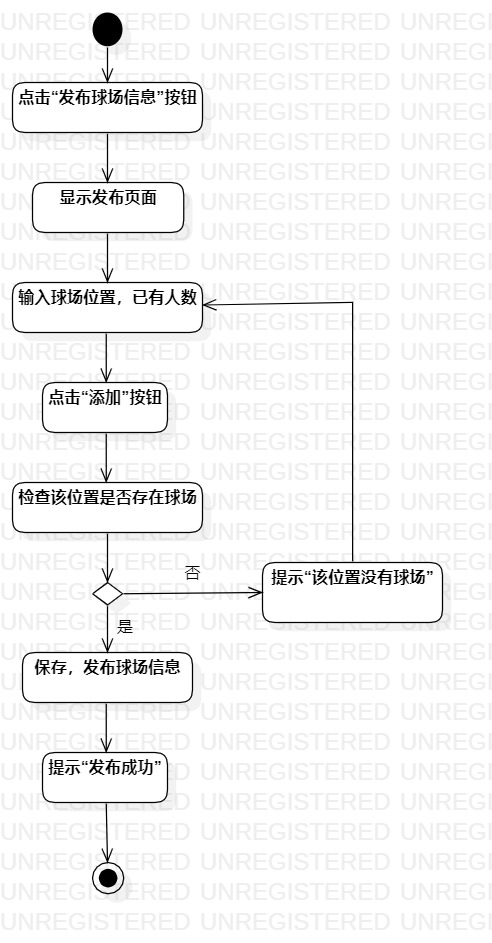
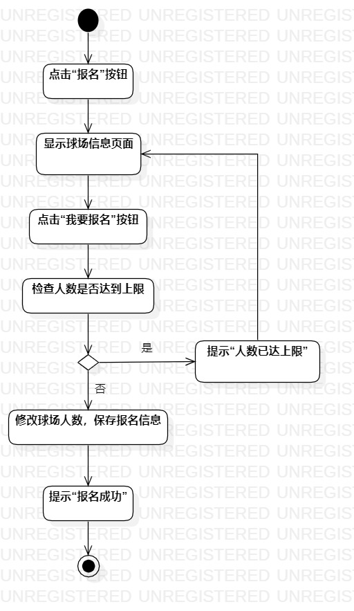

## 实验三：过程建模

## 1、实验目标
- 掌握过程建模方法；
- 掌握UML中活动图（Activity Diagram）的画法。

## 2、实验内容
- 观看视频学习过程建模方法；
- 画出活动图
- 使用Markdown编写实验报告。

## 3、实验步骤
- 在StarUML创建两个活动图（Activity Diagram）：
  - 发布招募帖活动图
  - 报名活动图
- 根据用例规约画图：
  - 使用Initial节点、Final节点确定起点和终点；
  - 使用Action图形画出基本流程和扩展流程；
  - 使用Decision节点画出分支操作；
  - 使用Control Flow将各流程连接。
- 调整活动图的大小与位置，使其工整。
　
## 4、实验结果

图1.发布招募帖活动图

图2.报名活动图