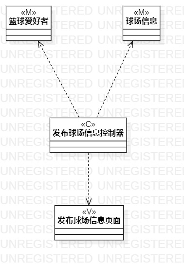
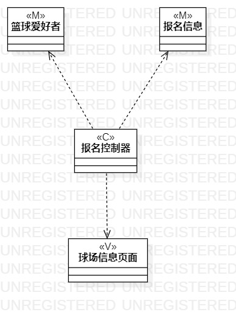

## 实验四：类建模
## 实验五：高级类建模

## 1、实验目标
- 掌握类建模方法
- 掌握MVC设计模式
- 掌握类图的画法

## 2、实验内容
- 基于MVC模式设计出类
- 设计类的关系
- 画出类图

## 3、实验步骤
- 观看教学视频学习类图的画法 
- 根据用例规约的流程确定类 
- 在StarUML画出已确定的类 
- 根据类之间的关系用相应的线连接各个类
- 撰写实验报告

## 4、实验结果

图1.发布招募帖类图

图2.报名类图