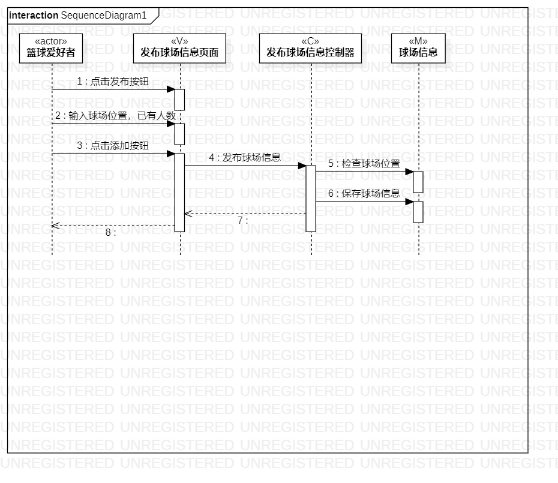
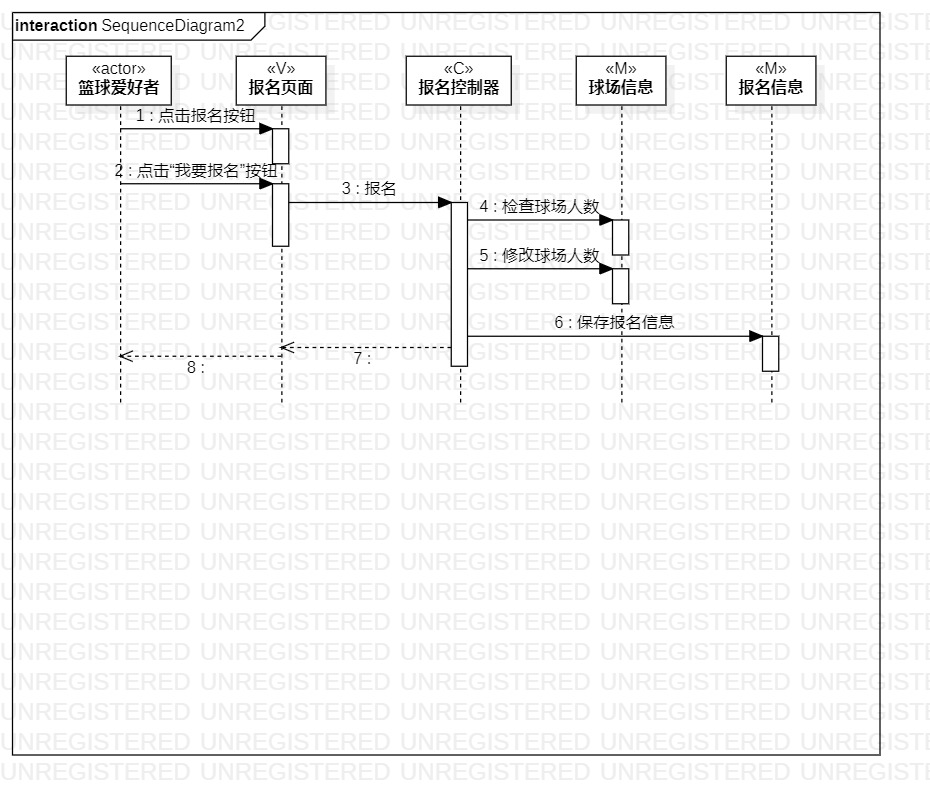

## 实验六：交互建模

## 1、实验目标
- 理解系统交互的概念
- 掌握UML顺序图的画法
- 掌握对象交互的定义与建模方法

## 2、实验内容
- 根据活动图和类图，确定功能所涉及的系统对象
- 在顺序图上画出参与者
- 在顺序图上画出消息

## 3、实验步骤
- 修正用例图、活动图和类图 
- 根据类图确定参与者 
- 根据用例图、活动图画出message 
- 根据用例图、活动图画出reply message
- 撰写实验报告

## 4、实验结果

图1.发布招募帖顺序图

图2.报名顺序图