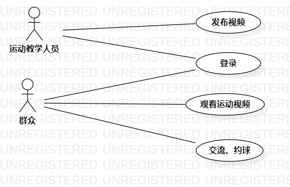

# 实验二：用例建模  

## 一、 实验目标  

1. 使用Markdown编写报告
2. 细化选题
3. 学习使用StarUML用例建模

## 二、 实验内容  

1. 创建用例图
2. 编写实验报告文档
3. 编写用例规约

## 三、 实验步骤  

1. 选题为运动教学系统
2. 根据issues在StarUML上创建用例图（Lab2_UseCaseDiagram）
3. 确定参与者（Actor）:  
      - 运动教学人员
      - 群众   
4. 确定用例（UserCase）:   
      - 观看视频
      - 发布视频
      - 约球
5. 建立Actor和UserCase之间的联系
6. 绘画用例图（Lab2_UseCaseDiagram）
7. 编写用例规约

## 四、 实验结果  

1. 画图  
  
图1:运动教学系统的用例图

## 表1：观看视频用例规约  

用例编号  | UC01 | 备注  
-|:-|-  
用例名称  | 观看视频  |   
前置条件  |  群众登录运动教学系统   |    
后置条件  | 群众进入选择运动教学界面   |    
基本流程  | 1. 群众点击选择运动按钮；  |*用例执行成功的步骤*    
~| 2. 系统显示运动选择页面；  |   
~| 3. 群众点击相应的运动图像按钮；  |   
~| 4. 系统显示相应的运动视频资讯；  |   
~| 5. 群众点击播放按钮；  |   
~| 5. 系统播放视频；  | 
扩展流程  | 4.1 系统检查发现运动视频缺失，提示群众“运动视频尚在努力更新中”。 |*用例执行失败*    

## 表2：发布视频用例规约  

用例编号  | UC02 | 备注  
-|:-|-  
用例名称  | 发布视频  |   
前置条件  |  运动教学人员登录运动教学系统   |  
后置条件  |  运动教学人员进入视频发布界面  |  
基本流程  | 1. 运动教学人员点击视频发布按钮；  |*用例执行成功的步骤*    
~| 2. 系统显示视频上传界面；  |   
~| 3. 运动教学人员上传相关视频，点击上传按钮；  |   
~| 4. 系统上传视频到审核人员；  |   
~| 5. 审核人员把审核结果录入系统；  | 
~| 6. 系统把审核结果发送到相应的邮箱；  |  
~| 7. 系统保存视频数据；  |  
~| 8. 系统修改视频专区，加入新的视频数据；  |    
扩展流程  | 6.1 审核结果为失败，系统额外发送失败原因到相应的邮箱。 |*用例执行失败* 

## 表3：约球用例规约  

用例编号  | UC03 | 备注  
-|:-|-  
用例名称  | 约球  |   
前置条件  |  群众登录运动教学系统  |   
后置条件  |  群众进入约球界面  |    
基本流程  | 1. 群众在约球界面选择自己相应的运动；  |*用例执行成功的步骤*    
~| 2.  群众选择约球范围； |   
~| 3. 系统定位群众位置附近的其它用户，获取相应的用户数据； |   
~| 4. 系统按照用户数据智能拉建群组，并保存群组数据； |   
~| 4. 系统提示“约球成功”；  |  
扩展流程  | 3.1 系统检查附近没有其它用户，提示群众“暂无用户，请稍后再试”。 |*用例执行失败* 