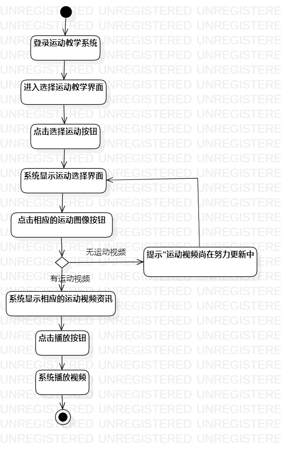
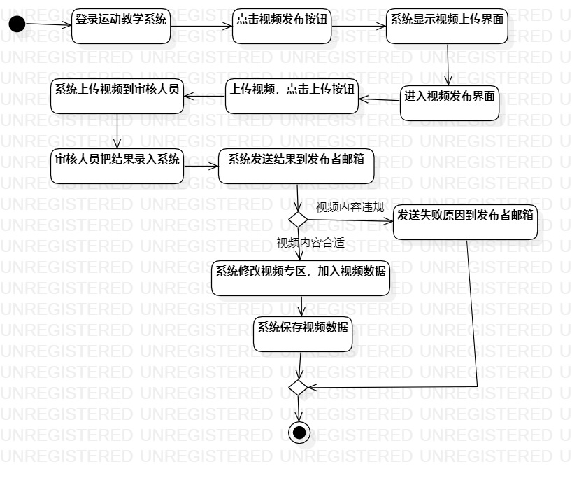
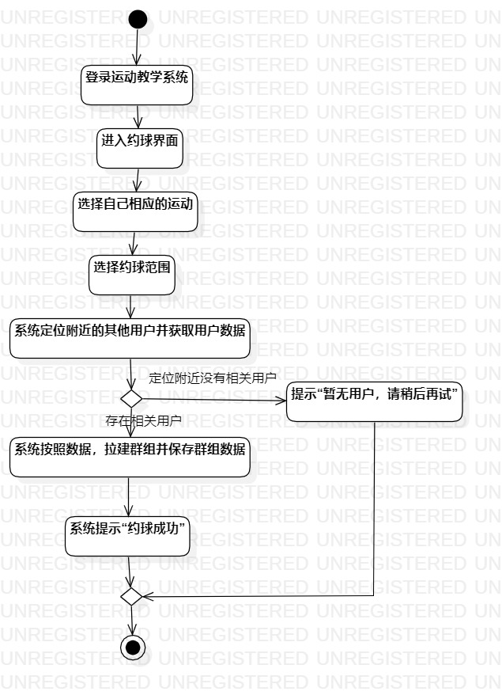

#实验三：过程建模

##一、实验目标

1、掌握过程建模方法。  
2、掌握活动图的画法。

##二、实验内容

1、根据用例规约绘制活动图。

##三、实验步骤

1、添加Initial节点；  
2、添加Final节点；  
3、根据用例规约添加Action；  
4、把基本流程和扩展流程的动作画为Action节点；  
5、分支的操作使用Decision节点；  
6、调整整体布局；

##四、实验结果

  
图1 观看视频的活动图

  
图2 发布视频的活动图

  
图3 约球的活动图

##五、实验总结

通过这次实验三的学习，粗略掌握了过程建模的方法和活动图的画法。

