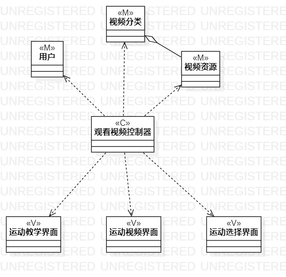

# 实验四五：类建模

## 一、 实验目标

1. 掌握类建模；
2. 了解MVC或你熟悉的设计模式；
3.掌握类图的画法（Class Diagram）；

## 二、 实验内容

1.基于MVC模式设计类
2.设计类的关系
3.画出类图

## 三、 实验步骤

1. 创建观看视频的类图项目
2. 根据用例规约创建用户类，视频分类类，视频资源类，观看视频控制器类，运动教学界面类，运动视频界面类，运动选择界面类
3. 用依赖线连接观看视频控制器类和其他类，使用聚合线连接视频分类类，视频资源类
4. 创建发布视频的类图项目
5. 根据用例规约创建用户类，审核结果、原因类，视频资源类，发布视频控制器类，视频发布界面类，视频上传界面类
6. 用依赖线连接发布视频控制器类图和其他类
7. 创建约球的类图项目
8. 根据用例规约创建用户类，用户群组类，用户定位类，约球控制器类，约球界面类，群组界面类
9. 用依赖线连接约球控制器类图和其他类，使用聚合线连接用户群组类，用户类，用户定位类

## 四、 实验结果

  

图1：观看视频的类图

  

图2：发布视频的类图

  

图3：发布视频的类图