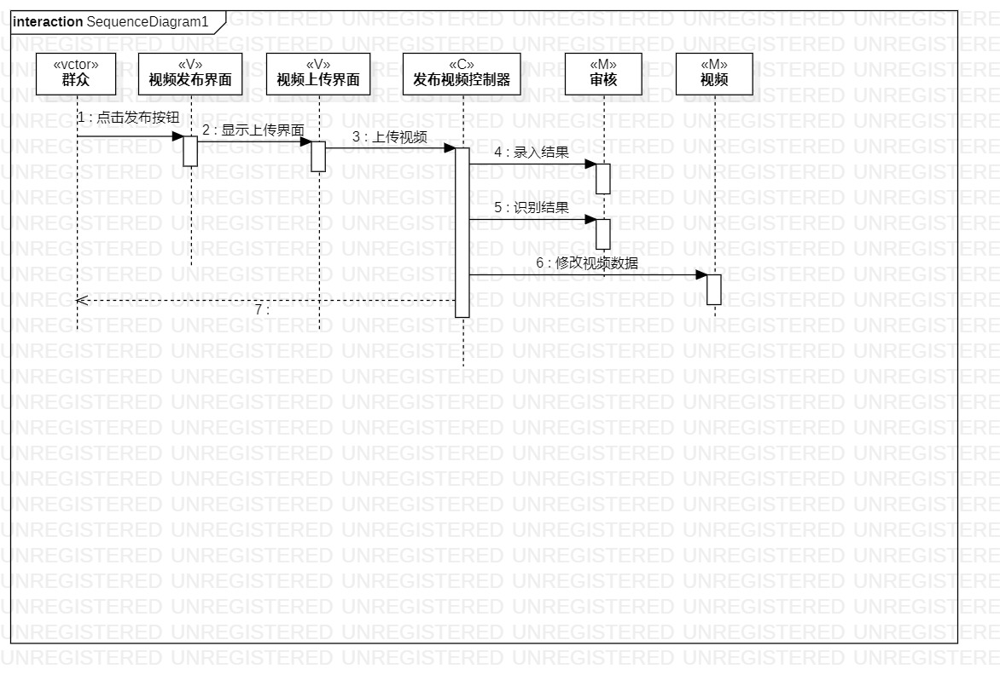
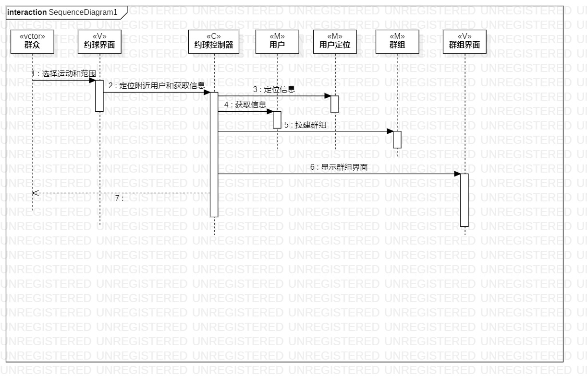

# 实验六

## 一、实验目标

1. 理解系统交互
2. 掌握UML顺序图的画法
3. 理解对象交互的定义与建模方法

## 二、实验内容

1. 观看教学视频，学习交互建模知识
2. 根据用例模型和类模型，确定功能所涉及的系统对象
3. 在顺序图上画出参与者（对象）
4. 在顺序图上画出消息（交互）

## 三、实验步骤

1. 到学习通查看学习步骤，然后在B站观看和学习交互建模知识
2. 根据用例模型和类模型，确定功能所涉及的系统对象
3. 根据 观看视频 的用例规约设计：
	- 参与者(actor)：群众
	- M：用户，视频，分类
	- V：运动教学界面，运动视频界面，运动选择界面
	- C：观看视频控制器
	- 消息(message)：观看视频-用例规约里的步骤
4. 根据 发布视频 的用例规约设计：
	- 参与者(actor)：群众
	- M：审核，视频
	- V：视频上传界面
	- C：发布视频控制器
	- 消息(message)：发布视频-用例规约里的步骤
5. 根据 约球 的用例规约设计：
	- 参与者(actor)：群众
	- M：用户，用户定位，群组，
	- V：约球界面，群组界面
	- C：约球控制器
	- 消息(message)：约球-用例规约里的步骤

## 四、实验结果
1. 画图  

  
图1. 观看视频的顺序图  

  
图2. 发布视频的顺序图  

  
图3. 约球的顺序图