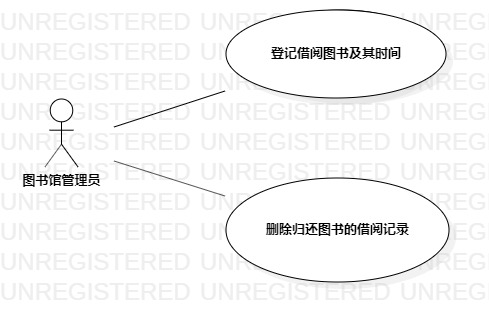

# 实验二：用例建模  

 ## 一、 实验目标  

 1. 使用Markdown编写报告
2. 选题
3. 学习使用StarUML用例建模

 ## 二、 实验内容  

 1. 创建用例图
2. 编写实验报告文档
3. 编写用例规约

 ## 三、 实验步骤  

 1. 选题为图书馆借阅系统
2. 确定参与者（Actor）:  
      - 图书馆管理员  
3. 确定用例（UserCase）:   
      - 登记借阅图书及其时间
      - 删除归还图书的借阅记录
4. 建立绘画用例图（lab2_UseCaseDiagram1）
5. 编写用例规约

 ## 四、 实验结果  

   
图1:图书馆管理系统的用例图

 ## 表1：登记借阅图书及其时间用例规约  

 用例编号  | UC01 | 备注  
-|:-|-  
用例名称  | 登记借阅图书及其时间  |   
前置条件  | 图书管理员登陆图书管理系统     | *可选*   
基本流程  | 1.图书管理员点击借书按钮；  |*用例执行成功的步骤*    
~| 2.系统显示图书馆借书页面；  |   
~| 3.图书管理员登记借出图书及其借出时间；|   
~| 4.系统显示借阅成功界面；   |   
~| 5. |  
扩展流程  | 3.1 图书管理员没有登记图书的借出时间；   |*用例执行失败*    

 ## 表2：删除归还图书的借阅记录  

 用例编号  | UC02 | 备注  
-|:-|-  
用例名称  | 删除归还图书的借阅记录  |   
前置条件  | 该图书已经借出    | *可选*     
基本流程  | 1.图书管理员点击还书按钮；  |*用例执行成功的步骤*    
~| 2.系统显示系统还书页面；  |   
~| 3.图书管理员登记归还图书；   |   
~| 4.系统删除借出图书的借阅记录；   |   
~| 5.系统显示还书成功界面。   |  
扩展流程  |    |*用例执行失败*    