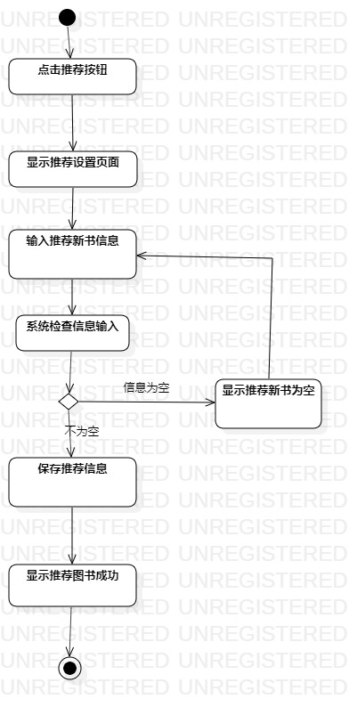
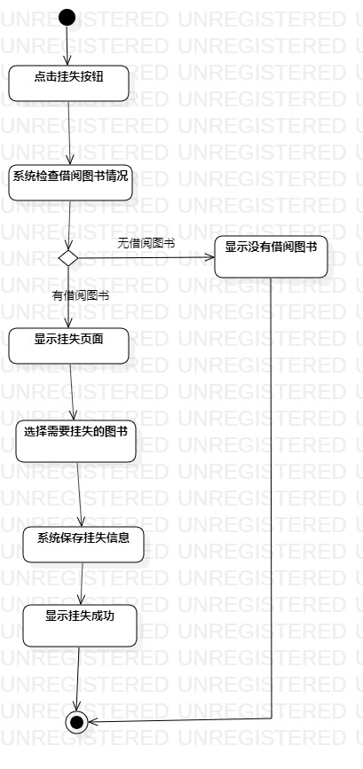

# 实验三： 过程建模

 ## 一、实验目标

 - 1.掌握过程建模方法；
- 2.掌握活动图的画法。（Activity Diagram）

 ## 二、实验内容

 - 使用StarUML画出活动图

 ## 三、实验步骤
- 1.推荐新书
    - 添加开始和结束结点
    - 添加点击推荐新书链接动作
    - 添加显示推荐设置页面
    - 判断输入的新书信息是否为空，如果推荐书目为空则提示推荐书目为空，然后结束，如果不为空，则继续
    - 添加保存新书信息动作
    - 添加显示推荐成功，结束

 - 2.挂失图书
    - 添加开始和结束结点
    - 添加点击挂失按钮
    - 添加显示挂失设置页面动作
    - 判断输入的挂失图书信息是否为空，如果挂失图书为空则提示挂失图书为空
    - 添加保存挂失图书信息
    - 添加显示挂失图书成功

 ## 四、实验结果

   
图1：推荐新书的活动图

   
图2：挂失图书的活动图