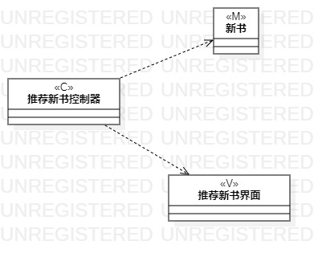
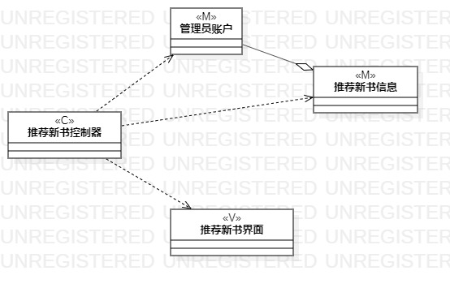

# 实验四：类建模

# 实验五:高级类建模

## 一、实验目标

1.掌握类建模方法；

2.了解MVC设计模式；

3.掌握类图的画法。（Class Diagram）

## 二、实验内容

1. 基于MVC模式设计类；

2. 设计类的关系；

3. 画出类图。

## 三、实验步骤

1.确定设计模式（MVC）；

2.根据用例规约确定类与类之间的关系；

3.在StarUML中画出相应的类；

4.给每个类建立关系。

## 四、实验结果

图1:推荐新书类图

图2:挂失图书类图
