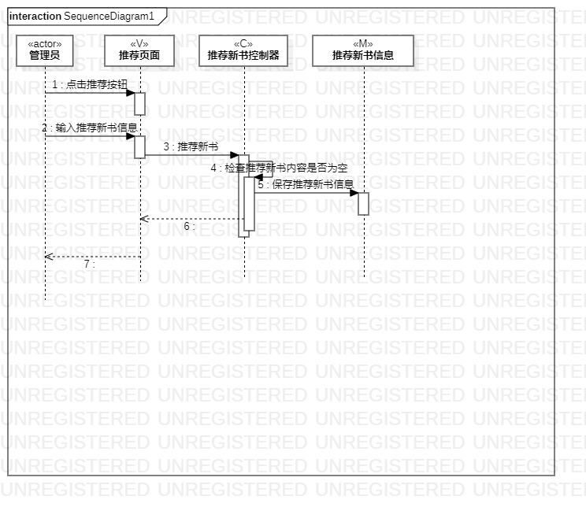
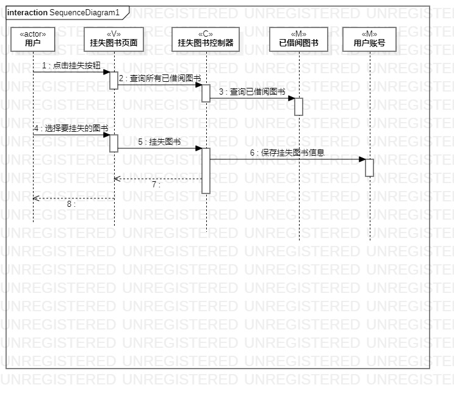

#实验六：相互作用建模

## 1. 实验目的
1. 理解系统交互；
2. 掌握UML顺序图的画法；
3. 掌握对象交互的定义与建模方法。

## 2. 实验内容

1. 学习交互建模和顺序图概念；
2. 学习顺序图画法；
3. 画用例顺序图。

## 3. 实验步骤

1. 根据用例模型和类模型，确定功能所涉及的系统对象# 实验六：交互建模

## 1. 实验目标

2. 根据类图画出所有的Lifeline
3. 根据活动图，按照顺序建立所有的Message
4. 在需要的位置建立Reply Message

## 4. 实验结果

图1：推荐新书图

图2：挂失图书图