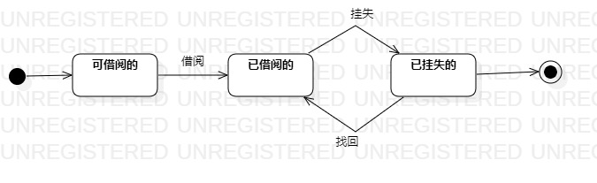

# 实验7：状态建模

## 一、实验目标
1. 掌握对象状态建模（状态图，Statechart）

## 二、实验内容
1. 根据用例图、用例规约、活动图、类图、顺序图来画图
2. 寻找关键对象
3. 设计该对象的关键状态
4. 设计状态之间的转变条件

## 三、实验步骤
1. 观看教学视频
2. 寻找关键对象-图书
3. 绘制书籍状态图
  - 状态：已借阅的，已挂失的
  - 添加状态间的转变条件

## 四、实验结果

图1：图书状态图