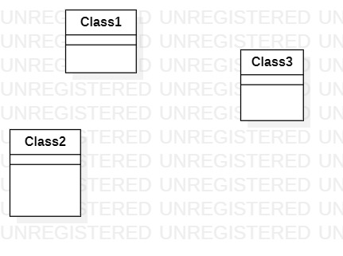

# 实验一

## 实验目标
1、了解git的基本操作  
2、了解StartUML的基本操作  
3、创建一个md文件，并且编辑为实验文档  
## 实验内容
1、fork项目，使用git clone将账号下的副本复制到本地磁盘，完成实验后使用git add、git commit -m "备注"、git push三条命令上传文件，最后使用pull request提交实验报告  
2、使用StartUML创建第一张UML图  
3、使用md文件编辑实验报告  
## 实验结果

