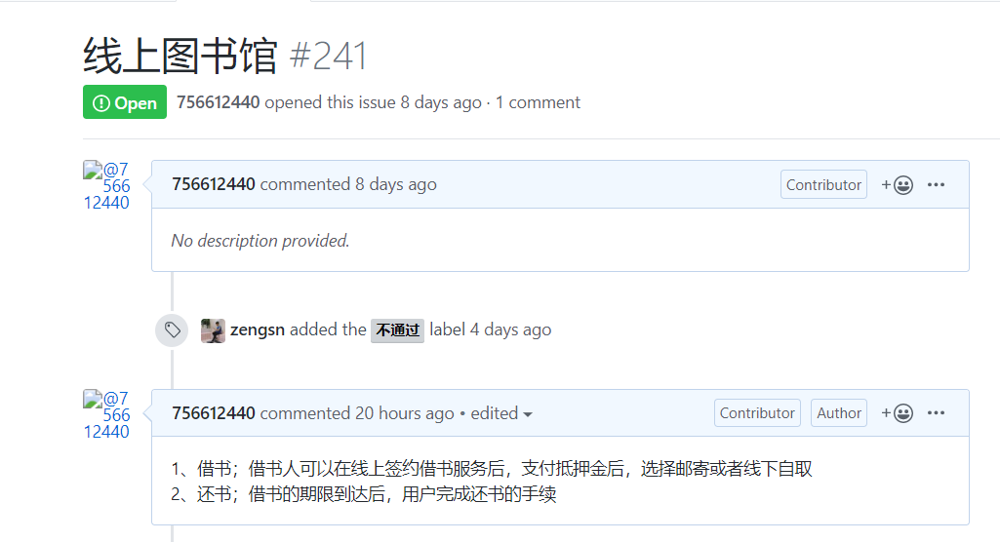

# 实验二：用例建模

## 1. 实验目标

- 学会用画UseCase用例图
- 学会编写用例规约
- 学会细化出功能需求

## 2. 实验内容

- 确认一个选题
- 画出用例图
- 编写用例规约

## 3. 实验步骤

- 在GitHub提交选题，写出功能需求  
- 使用StartUML画出用例图
- 编写用例规约

## 4. 实验结果

图1：需求功能图

图2：线上图书馆系统的用例图

## 表1：借书用例规约  

用例编号  | UC01 | 备注  
-|:-|-  
用例名称  | 借书  |   
前置条件  | 借阅用户登录，图书管理员登录     |   
基本流程  | 1. 借阅用户选好自己想要借的一本或多本书，点击确定；  |*用例执行成功的步骤*    
~| 2. 系统查询到书本还有库存，检查到借阅用户已实名认证以及检查到借阅用户借书信用分数；  |   
~| 3. 借阅用户选择自取或者邮寄，并且支付押金；  |   
~| 4. 系统根据借阅用户的选择，通知图书管理员；  |   
~| 5. 图书管理员点击确认接受订单；  |  
~| 6. 系统更新订单状态为“已受理”；  | 
~| 7. 借阅用户拿到书本后，点击确认收货；  | 
~| 8. 系统更新订单状态为“已收货”；  | 
扩展流程  |2.1 系统发现没有库存；  |*用例执行失败*    
~| 2.2 借阅用户还未实名认证；  |  
~| 2.3 借阅用户借书信用分数不达标；  |  

## 表2：还书用例规约  

用例编号  | UC02 | 备注  
-|:-|-  
用例名称  | 还书  |   
前置条件  | 借阅用户登录，图书管理员登录     |   
基本流程  | 1. 借阅用户选择未完成的借书订单，点击还书；  |*用例执行成功的步骤*    
~| 2. 系统查询订单信息，查询没有超过还书日期，发送还书地址；  |   
~| 3. 图书管理员点击确认收到书本；  |   
~| 4. 系统退回押金给借阅用户；  |   
~| 5. 借阅用户确认收到押金无误后，点击完成订单； |  
~| 6. 系统完成订单，更新用户的借书信用分数；  |  
扩展流程  |2.1 系统查询超过了还书日期，计算滞纳金，并且在押金中扣除；  |*用例执行失败*    
~| 3.1 管理员发现书本遗漏破损，扣除借阅用户的押金；  |  
~| 4.1 系统检测到押金为负数，提示用户补交押金；  |  
~| 5.1 借阅用户对押金余额有异议，提交受理；  |  
