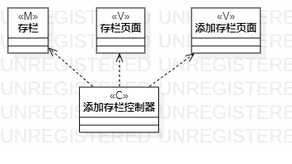
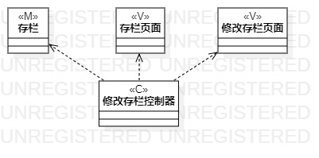

# 实验四：类建模 实验五：高级类建模

## 一、实验目标  
1、掌握类建模方法  
2、了解MVC或你熟悉的设计模式  
3、掌握类图的画法（Class Diagram）  

## 二、实验内容  
1、基于MVC模式设计类  
2、设计类的关系  
3、画出类图  

## 三、实验步骤  
1、确定设计模式为MVC模式  
2、在StarUML中新建Class Diagram  
3、根据实验二用例规约确定类  
4、用class画出类，包括控制器与界面  

## 四、实验结果  

### 类图如下：  

  
图1:添加入栏类图  
  
  
图2：修改存栏类图  
