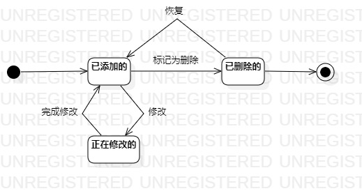

# 实验七：状态建模

## 一、实验目标

1. 掌握状态图及其画法（状态图，Statechart）

## 二、实验内容

1. 学习并理解状态图的定义
2. 寻找1个重要的对象；
3. 寻找这个对象的所有关键状态；
4. 画出状态之间的转换条件。
5. 画状态图

## 三、实验步骤

1. 寻找对象（肉鸡存栏）

2. 寻找对象的关键状态（已添加的，已删除的，正在修改的）

3. 寻找转换条件

4. 绘制状态图

## 四、实验结果

图:肉鸡存栏状态图
