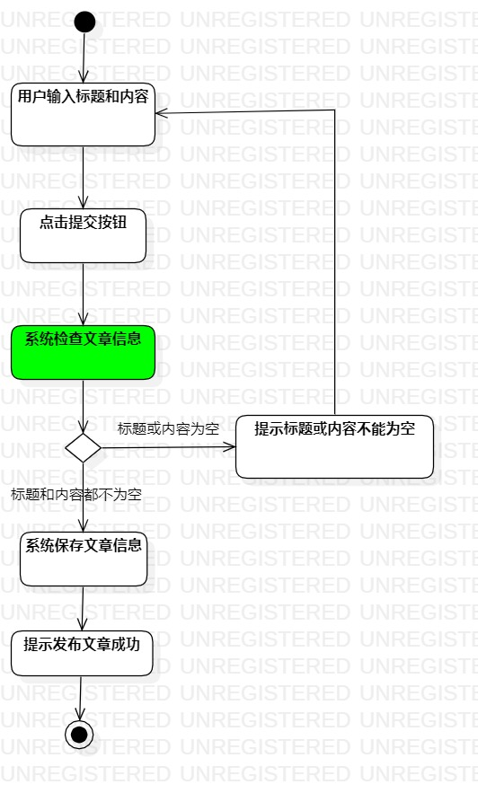
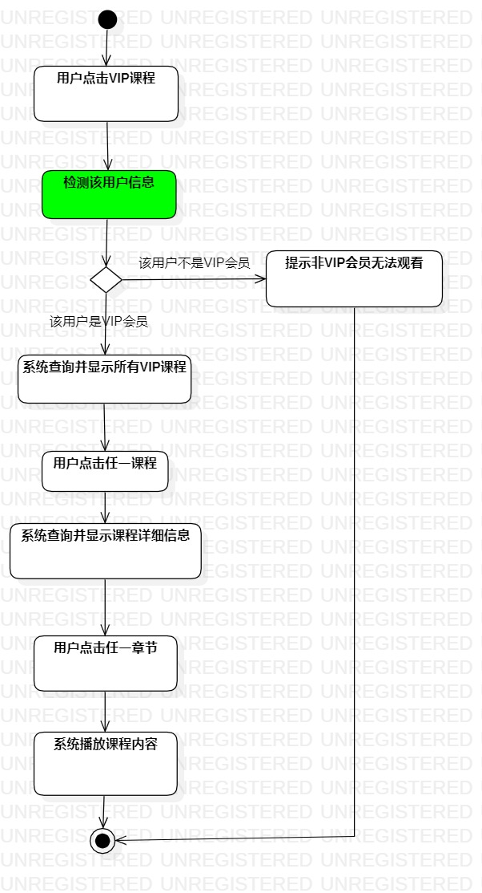

# 实验三

## 一、实验目标
1. 掌握过程建模方法；
2. 掌握活动图的画法。

## 二、实验内容
1. 观看视频和查看实验文档；
2. 修改实验二部分用例规约；
3. 根据修改的用例规约画出活动图；
4. 编写实验报告。

## 三、实验步骤

1. 打开StarUML创建ActivityDiagram；
2. 根据用例规约画出活动图；
3. 编写实验报告；
4. 使用Git Bash提交实验。

## 四、实验结果

图一：写文章活动图。

图二：观看VIP会员课程活动图。

