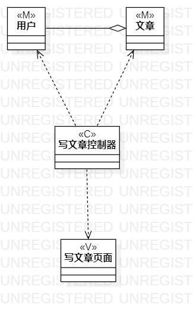
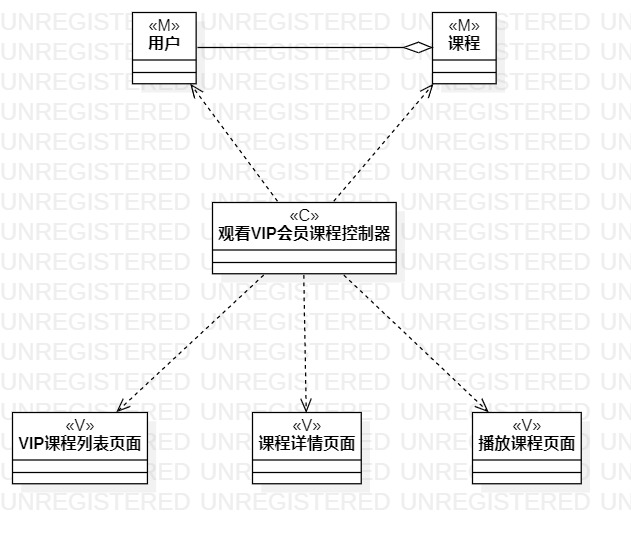

# 实验四：类建模

# 实验五：高级类建模

## 一、实验目标
1. 掌握类建模方法；
2. 了解MVC设计模式；
3. 掌握类图的画法；
4. 理解类的5种关系；
5. 掌握类之间关系的画法

## 二、实验内容
1. 根据用例规约画出相应的类图。

## 三、实验步骤

1. 观看视频，查看实验文档；
2. 打开StarUML创建类图：
3. 从用例规约中的基本流程和扩展流程中寻找类；
4. 给系统操作设计业务服务类；
5. 根据mvc设计模式确定类的关系；
6. 使用Git Bash提交实验。

## 四、实验结果

图一：写文章类图。

图二：观看VIP会员课程类图。

