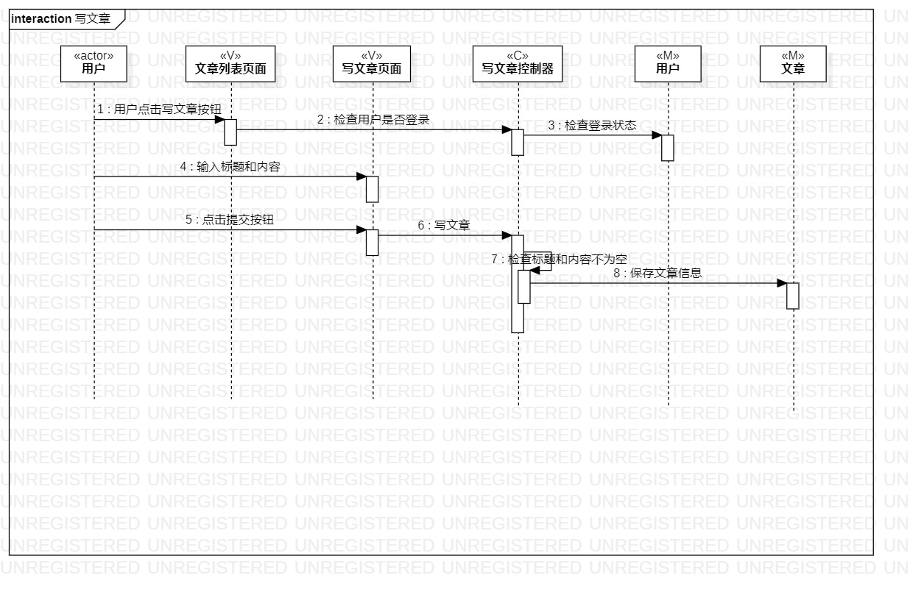
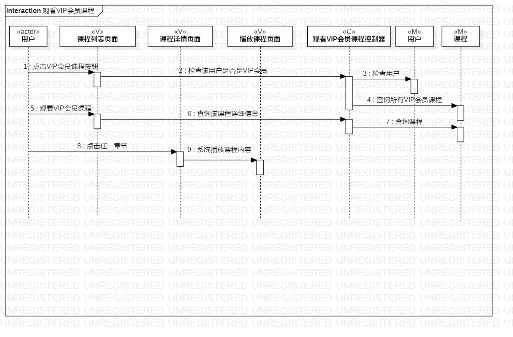

# 实验六：交互建模

## 一、实验目标
1. 理解系统交互；
2. 掌握UML顺序图的画法；
3. 掌握对象交互的定义与建模方法。

## 二、实验内容
1. 根据活动图和类图画出相应的顺序图。

## 三、实验步骤

1. 观看视频，查看实验文档；
2. 修改活动图和类图：
3. 根据修改的活动图和类图画出相应的顺序图；
4. 编写实验文档；
6. 使用Git Bash提交实验。

## 四、实验结果

图一：写文章顺序图。

图二：观看VIP会员课程顺序图。

