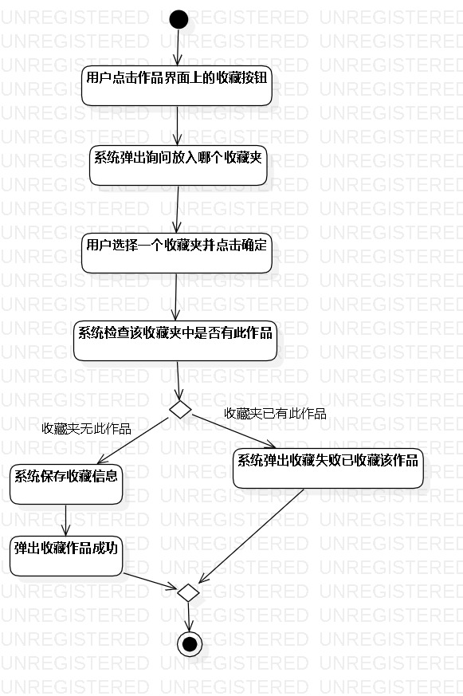
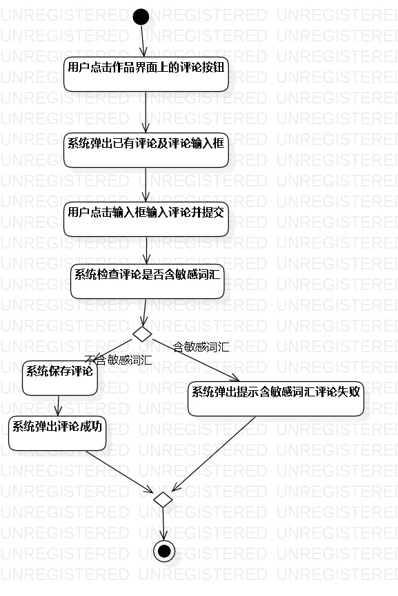
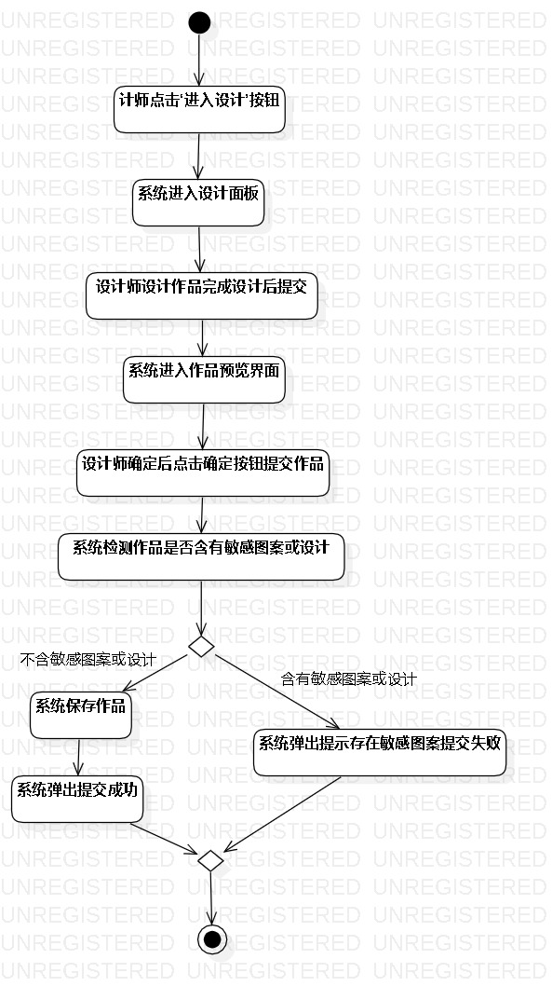

# 实验三：过程建模

## 一、实验目标
1、掌握过程建模方法  
2、掌握活动图的画法（活动图）  

## 二、实验步骤
1、确定有三个用例：收藏、评论、设计作品  
2、对收藏用例进行过程建模  
3、对评论用例进行过程建模  
4、对设计用例进行过程建模  
5、将三个过程建模模型导出成jpeg图片  

## 三、实验结果
1、用例收藏的过程建模图  
  

2、用例评论的过程建模图  
  

3、用例设计作品的过程建模图  
  

