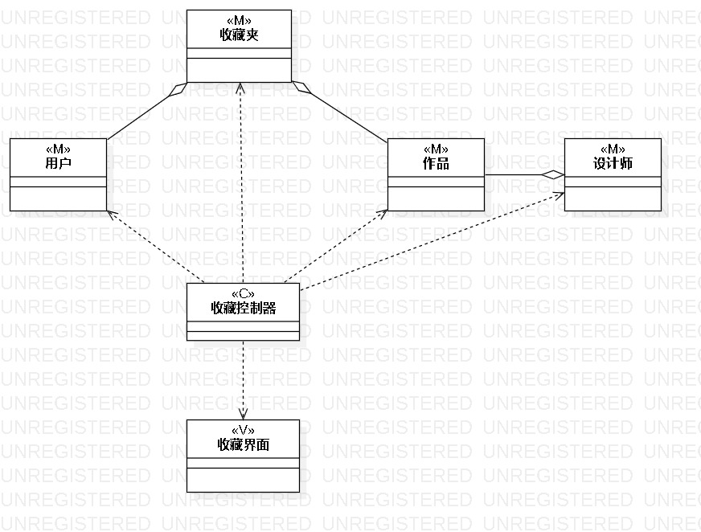
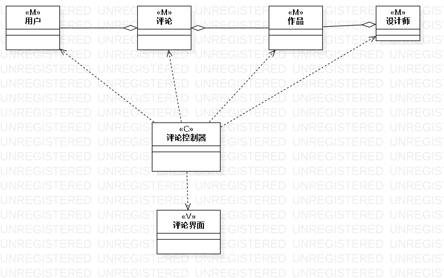
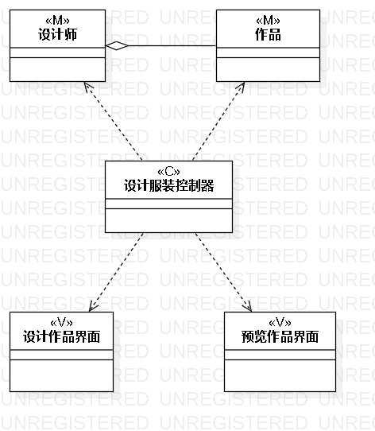

# 实验四：类建模

## 一、实验目标
1、掌握类建模方法；  
2、了解MVC或您熟悉的设计模式；  
3、掌握类图的画法。（类图）  

## 二、实验内容  
1、基于MVC模式设计类；  
2、设计类的关系  
3、画出类图。  

## 三、实验步骤
1、确定用例收藏的类：  
- M：用户、收藏夹、作品、设计师  
- V：收藏界面  
- C：收藏控制器  

2、确定用例评论的类：
- M：用户、评论、作品、设计师
- V：评论界面
- C：评论控制器

3、确定用例设计服装的类：
- M：设计师、作品
- V：设计作品界面、预览作品界面
- C：设计服装控制器

4、进行类建模

## 四、实验结果
1、用例收藏的类建模  
  

2、用例评论的类建模  
  

3、用例设计服装的类建模  
  
